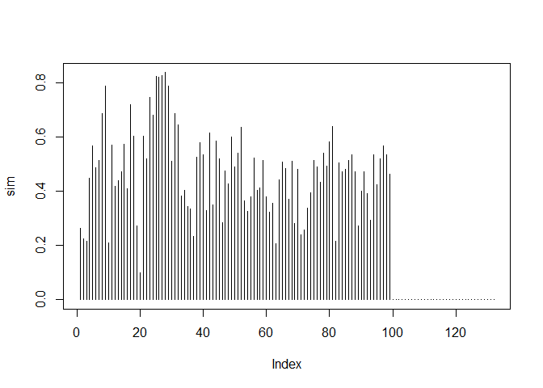
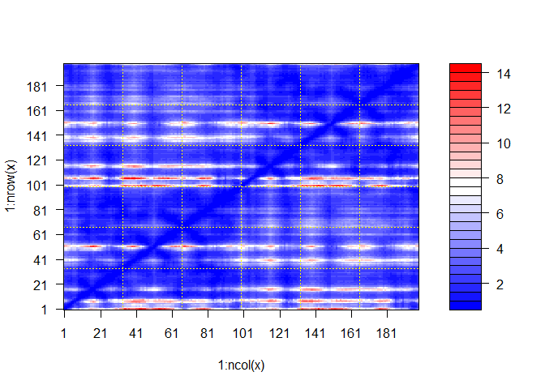
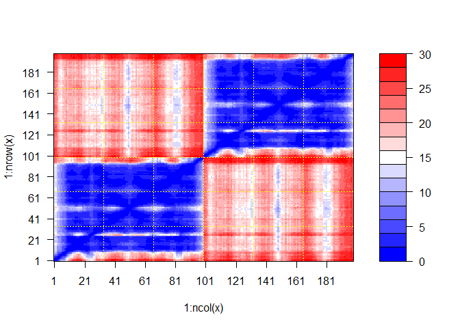

# Class 11
Courtney Cameron PID:A69028599

# AlphaFold

alphafold can be run through GoogleColab:
https://colab.research.google.com/github/sokrypton/ColabFold

``` r
pth <- "hivprdimer_23119/"

list.files(path=pth)
```

     [1] "cite.bibtex"                                                                    
     [2] "config.json"                                                                    
     [3] "hivprdimer_23119.a3m"                                                           
     [4] "hivprdimer_23119.csv"                                                           
     [5] "hivprdimer_23119.done.txt"                                                      
     [6] "hivprdimer_23119_coverage.png"                                                  
     [7] "hivprdimer_23119_env"                                                           
     [8] "hivprdimer_23119_pae.png"                                                       
     [9] "hivprdimer_23119_plddt.png"                                                     
    [10] "hivprdimer_23119_predicted_aligned_error_v1.json"                               
    [11] "hivprdimer_23119_scores_rank_001_alphafold2_multimer_v3_model_1_seed_000.json"  
    [12] "hivprdimer_23119_scores_rank_002_alphafold2_multimer_v3_model_5_seed_000.json"  
    [13] "hivprdimer_23119_scores_rank_003_alphafold2_multimer_v3_model_4_seed_000.json"  
    [14] "hivprdimer_23119_scores_rank_004_alphafold2_multimer_v3_model_2_seed_000.json"  
    [15] "hivprdimer_23119_scores_rank_005_alphafold2_multimer_v3_model_3_seed_000.json"  
    [16] "hivprdimer_23119_unrelaxed_rank_001_alphafold2_multimer_v3_model_1_seed_000.pdb"
    [17] "hivprdimer_23119_unrelaxed_rank_002_alphafold2_multimer_v3_model_5_seed_000.pdb"
    [18] "hivprdimer_23119_unrelaxed_rank_003_alphafold2_multimer_v3_model_4_seed_000.pdb"
    [19] "hivprdimer_23119_unrelaxed_rank_004_alphafold2_multimer_v3_model_2_seed_000.pdb"
    [20] "hivprdimer_23119_unrelaxed_rank_005_alphafold2_multimer_v3_model_3_seed_000.pdb"
    [21] "log.txt"                                                                        

The multiple sequence alignement (MSA) is conatined in the ‘a3m’ file

return full a3m file name within the directory of the alignment file

``` r
aln.file <- list.files(path=pth, pattern = '.a3m', all.files=FALSE, full.names = TRUE)
```

``` r
library(bio3d)
```

    Warning: package 'bio3d' was built under R version 4.2.3

``` r
aln <- read.fasta(aln.file, to.upper = TRUE)
```

    [1] " ** Duplicated sequence id's: 101 **"
    [2] " ** Duplicated sequence id's: 101 **"

``` r
attributes(aln)
```

    $names
    [1] "id"   "ali"  "call"

    $class
    [1] "fasta"

``` r
dim(aln$ali)
```

    [1] 5378  132

Calculating sum summary info such as conservation scores

``` r
sim <- conserv(aln)
```

``` r
plot(sim, typ='h')
```



the coserved columns can be summarized with a consensus sequence

``` r
con <- consensus(aln, cutoff = 0.9)
con$seq
```

      [1] "-" "-" "-" "-" "-" "-" "-" "-" "-" "-" "-" "-" "-" "-" "-" "-" "-" "-"
     [19] "-" "-" "-" "-" "-" "-" "D" "T" "G" "A" "-" "-" "-" "-" "-" "-" "-" "-"
     [37] "-" "-" "-" "-" "-" "-" "-" "-" "-" "-" "-" "-" "-" "-" "-" "-" "-" "-"
     [55] "-" "-" "-" "-" "-" "-" "-" "-" "-" "-" "-" "-" "-" "-" "-" "-" "-" "-"
     [73] "-" "-" "-" "-" "-" "-" "-" "-" "-" "-" "-" "-" "-" "-" "-" "-" "-" "-"
     [91] "-" "-" "-" "-" "-" "-" "-" "-" "-" "-" "-" "-" "-" "-" "-" "-" "-" "-"
    [109] "-" "-" "-" "-" "-" "-" "-" "-" "-" "-" "-" "-" "-" "-" "-" "-" "-" "-"
    [127] "-" "-" "-" "-" "-" "-"

reading in the structure models

Read the PAE (predicted aligned arror files) into R, these files are
stored in JSON format

``` r
library(jsonlite)
```

    Warning: package 'jsonlite' was built under R version 4.2.3

``` r
pae.file <- list.files(path=pth,pattern='.000.json',full.names = TRUE)
pae.file
```

    [1] "hivprdimer_23119/hivprdimer_23119_scores_rank_001_alphafold2_multimer_v3_model_1_seed_000.json"
    [2] "hivprdimer_23119/hivprdimer_23119_scores_rank_002_alphafold2_multimer_v3_model_5_seed_000.json"
    [3] "hivprdimer_23119/hivprdimer_23119_scores_rank_003_alphafold2_multimer_v3_model_4_seed_000.json"
    [4] "hivprdimer_23119/hivprdimer_23119_scores_rank_004_alphafold2_multimer_v3_model_2_seed_000.json"
    [5] "hivprdimer_23119/hivprdimer_23119_scores_rank_005_alphafold2_multimer_v3_model_3_seed_000.json"

``` r
pae5 <- read_json(pae.file[5], simplifyVector = TRUE)
pae1 <- read_json(pae.file[1], simplifyVector = TRUE)
```

``` r
dim(pae1$pae)
```

    [1] 198 198

``` r
plot.dmat(pae1$pae)
```



``` r
plot.dmat(pae5$pae)
```


