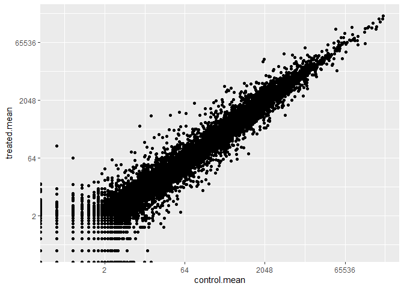
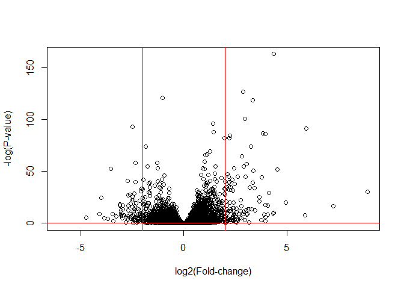

# Class 13
Courtney Cameron PID:A69028599

``` r
library(BiocManager)
```

    Warning: package 'BiocManager' was built under R version 4.2.3

    Bioconductor version '3.15' is out-of-date; the current release version '3.18'
      is available with R version '4.3'; see https://bioconductor.org/install

``` r
library(DESeq2)
```

    Loading required package: S4Vectors

    Loading required package: stats4

    Loading required package: BiocGenerics


    Attaching package: 'BiocGenerics'

    The following objects are masked from 'package:stats':

        IQR, mad, sd, var, xtabs

    The following objects are masked from 'package:base':

        anyDuplicated, append, as.data.frame, basename, cbind, colnames,
        dirname, do.call, duplicated, eval, evalq, Filter, Find, get, grep,
        grepl, intersect, is.unsorted, lapply, Map, mapply, match, mget,
        order, paste, pmax, pmax.int, pmin, pmin.int, Position, rank,
        rbind, Reduce, rownames, sapply, setdiff, sort, table, tapply,
        union, unique, unsplit, which.max, which.min


    Attaching package: 'S4Vectors'

    The following objects are masked from 'package:base':

        expand.grid, I, unname

    Loading required package: IRanges


    Attaching package: 'IRanges'

    The following object is masked from 'package:grDevices':

        windows

    Loading required package: GenomicRanges

    Loading required package: GenomeInfoDb

    Loading required package: SummarizedExperiment

    Loading required package: MatrixGenerics

    Loading required package: matrixStats

    Warning: package 'matrixStats' was built under R version 4.2.3


    Attaching package: 'MatrixGenerics'

    The following objects are masked from 'package:matrixStats':

        colAlls, colAnyNAs, colAnys, colAvgsPerRowSet, colCollapse,
        colCounts, colCummaxs, colCummins, colCumprods, colCumsums,
        colDiffs, colIQRDiffs, colIQRs, colLogSumExps, colMadDiffs,
        colMads, colMaxs, colMeans2, colMedians, colMins, colOrderStats,
        colProds, colQuantiles, colRanges, colRanks, colSdDiffs, colSds,
        colSums2, colTabulates, colVarDiffs, colVars, colWeightedMads,
        colWeightedMeans, colWeightedMedians, colWeightedSds,
        colWeightedVars, rowAlls, rowAnyNAs, rowAnys, rowAvgsPerColSet,
        rowCollapse, rowCounts, rowCummaxs, rowCummins, rowCumprods,
        rowCumsums, rowDiffs, rowIQRDiffs, rowIQRs, rowLogSumExps,
        rowMadDiffs, rowMads, rowMaxs, rowMeans2, rowMedians, rowMins,
        rowOrderStats, rowProds, rowQuantiles, rowRanges, rowRanks,
        rowSdDiffs, rowSds, rowSums2, rowTabulates, rowVarDiffs, rowVars,
        rowWeightedMads, rowWeightedMeans, rowWeightedMedians,
        rowWeightedSds, rowWeightedVars

    Loading required package: Biobase

    Welcome to Bioconductor

        Vignettes contain introductory material; view with
        'browseVignettes()'. To cite Bioconductor, see
        'citation("Biobase")', and for packages 'citation("pkgname")'.


    Attaching package: 'Biobase'

    The following object is masked from 'package:MatrixGenerics':

        rowMedians

    The following objects are masked from 'package:matrixStats':

        anyMissing, rowMedians

``` r
counts <- read.csv('airway_scaledcounts.csv', row.names=1)
metadata <- read.csv('airway_metadata.csv')
```

``` r
head(counts)
```

                    SRR1039508 SRR1039509 SRR1039512 SRR1039513 SRR1039516
    ENSG00000000003        723        486        904        445       1170
    ENSG00000000005          0          0          0          0          0
    ENSG00000000419        467        523        616        371        582
    ENSG00000000457        347        258        364        237        318
    ENSG00000000460         96         81         73         66        118
    ENSG00000000938          0          0          1          0          2
                    SRR1039517 SRR1039520 SRR1039521
    ENSG00000000003       1097        806        604
    ENSG00000000005          0          0          0
    ENSG00000000419        781        417        509
    ENSG00000000457        447        330        324
    ENSG00000000460         94        102         74
    ENSG00000000938          0          0          0

``` r
head(metadata)
```

              id     dex celltype     geo_id
    1 SRR1039508 control   N61311 GSM1275862
    2 SRR1039509 treated   N61311 GSM1275863
    3 SRR1039512 control  N052611 GSM1275866
    4 SRR1039513 treated  N052611 GSM1275867
    5 SRR1039516 control  N080611 GSM1275870
    6 SRR1039517 treated  N080611 GSM1275871

> Q1. How many genes are in this dataset?

38694 genes in the data set

``` r
nrow(counts)
```

    [1] 38694

> Q how many samples are there

8 differnt samples

``` r
ncol(counts)
```

    [1] 8

> Q2 How many ‘control’ cell lines do we have?

4 control cell lines were used

``` r
sum(metadata$dex =='control')
```

    [1] 4

make sure the the id’s in the metadata match those in the counts

``` r
all(metadata$id == colnames(counts))
```

    [1] TRUE

control mean

``` r
control.inds <- metadata$dex == 'control'
control.counts <- counts[,control.inds]
control.mean<- apply(control.counts,1,mean)
head(control.mean)
```

    ENSG00000000003 ENSG00000000005 ENSG00000000419 ENSG00000000457 ENSG00000000460 
             900.75            0.00          520.50          339.75           97.25 
    ENSG00000000938 
               0.75 

> Q3. How would you make the above code in either approach more robust?
> Is there a function that could help here?

Writing this process into a function would be more robust as opposed to
copying where there is more room for error. if there were more treatmets
it would save time and leave less space for mistakes.

> Q4. Follow the same procedure for the treated samples (i.e. calculate
> the mean per gene across drug treated samples and assign to a labeled
> vector called treated.mean)

treated mean

``` r
treated.inds <- metadata$dex == 'treated'
treated.counts <- counts[,treated.inds]
treated.mean<- apply(treated.counts,1,mean)
head(treated.mean)
```

    ENSG00000000003 ENSG00000000005 ENSG00000000419 ENSG00000000457 ENSG00000000460 
             658.00            0.00          546.00          316.50           78.75 
    ENSG00000000938 
               0.00 

combining the treated and control means into one data frame

``` r
meancounts <- data.frame(control.mean, treated.mean)
head(meancounts)
```

                    control.mean treated.mean
    ENSG00000000003       900.75       658.00
    ENSG00000000005         0.00         0.00
    ENSG00000000419       520.50       546.00
    ENSG00000000457       339.75       316.50
    ENSG00000000460        97.25        78.75
    ENSG00000000938         0.75         0.00

> Q5 (a). Create a scatter plot showing the mean of the treated samples
> against the mean of the control samples. Your plot should look
> something like the following

``` r
plot(meancounts$control.mean,meancounts$treated.mean)
```


> Q5 (b).You could also use the ggplot2 package to make this figure
> producing the plot below. What geom\_?() function would you use for
> this plot?

``` r
library(ggplot2)
```

    Warning: package 'ggplot2' was built under R version 4.2.3

``` r
ggplot(meancounts, aes(control.mean, treated.mean))+
  geom_point()
```


> Q6. Try plotting both axes on a log scale. What is the argument to
> plot() that allows you to do this?

``` r
ggplot(meancounts, aes(control.mean, treated.mean))+
  geom_point()+
  scale_x_continuous(trans="log2")+
  scale_y_continuous(trans='log2')
```

    Warning: Transformation introduced infinite values in continuous x-axis

    Warning: Transformation introduced infinite values in continuous y-axis



Determining fold change between control and treated

``` r
meancounts$log2fc <- log2(meancounts$treated.mean/meancounts$control.mean)
head(meancounts)
```

                    control.mean treated.mean      log2fc
    ENSG00000000003       900.75       658.00 -0.45303916
    ENSG00000000005         0.00         0.00         NaN
    ENSG00000000419       520.50       546.00  0.06900279
    ENSG00000000457       339.75       316.50 -0.10226805
    ENSG00000000460        97.25        78.75 -0.30441833
    ENSG00000000938         0.75         0.00        -Inf

removing the zero values from the data set

``` r
zero.sum <- rowSums(meancounts[,1:2] == 0)
to.rm.idn <-zero.sum>0
mycounts <- meancounts[!to.rm.idn,]
nrow(mycounts)
```

    [1] 21817

a common threshold for calling domething differently expressed is a
log2FC of +2 or -2 \>Q8. Using the up.ind vector above can you determine
how many up regulated genes we have at the greater than 2 fc level? how
many of the genes are “up regulated”

``` r
sum(mycounts$log2fc >= 2)
```

    [1] 314

> Q9. Using the down.ind vector above can you determine how many down
> regulated genes we have at the greater than 2 fc level?

``` r
sum(mycounts$log2fc <= -2)
```

    [1] 485

> Q10. Do you trust these results? Why or why not?

this is only looking at the difference of the means, so we are only
looking at the change between two valuse without knowing if there is
variance in the values put into the means and we don’t know the
expression change is significant

Doing the analysis with DESeq2

``` r
library(DESeq2)
```

setup for DESeq analysis

``` r
dds<-DESeqDataSetFromMatrix(countData=counts,
                       colData=metadata,
                       design=~dex)
```

    converting counts to integer mode

    Warning in DESeqDataSet(se, design = design, ignoreRank): some variables in
    design formula are characters, converting to factors

``` r
dds<-DESeq(dds)
```

    estimating size factors

    estimating dispersions

    gene-wise dispersion estimates

    mean-dispersion relationship

    final dispersion estimates

    fitting model and testing

``` r
res<- results(dds)
res
```

    log2 fold change (MLE): dex treated vs control 
    Wald test p-value: dex treated vs control 
    DataFrame with 38694 rows and 6 columns
                     baseMean log2FoldChange     lfcSE      stat    pvalue
                    <numeric>      <numeric> <numeric> <numeric> <numeric>
    ENSG00000000003  747.1942     -0.3507030  0.168246 -2.084470 0.0371175
    ENSG00000000005    0.0000             NA        NA        NA        NA
    ENSG00000000419  520.1342      0.2061078  0.101059  2.039475 0.0414026
    ENSG00000000457  322.6648      0.0245269  0.145145  0.168982 0.8658106
    ENSG00000000460   87.6826     -0.1471420  0.257007 -0.572521 0.5669691
    ...                   ...            ...       ...       ...       ...
    ENSG00000283115  0.000000             NA        NA        NA        NA
    ENSG00000283116  0.000000             NA        NA        NA        NA
    ENSG00000283119  0.000000             NA        NA        NA        NA
    ENSG00000283120  0.974916      -0.668258   1.69456 -0.394354  0.693319
    ENSG00000283123  0.000000             NA        NA        NA        NA
                         padj
                    <numeric>
    ENSG00000000003  0.163035
    ENSG00000000005        NA
    ENSG00000000419  0.176032
    ENSG00000000457  0.961694
    ENSG00000000460  0.815849
    ...                   ...
    ENSG00000283115        NA
    ENSG00000283116        NA
    ENSG00000283119        NA
    ENSG00000283120        NA
    ENSG00000283123        NA

visualization of differential expression is a volcano plot, plotting
fold change by pvalue

``` r
plot(res$log2FoldChange,-log(res$padj),
     ylab="-log(P-value)",
     xlab='log2(Fold-change)')
abline(v=c(-2,2), col='red')
abline(h=-0.05, col='red')
```



Save the results

``` r
write.csv(res, file='myresults.csv')
```

Adding annotation data

``` r
library("AnnotationDbi")
library("org.Hs.eg.db")
```

``` r
columns(org.Hs.eg.db)
```

     [1] "ACCNUM"       "ALIAS"        "ENSEMBL"      "ENSEMBLPROT"  "ENSEMBLTRANS"
     [6] "ENTREZID"     "ENZYME"       "EVIDENCE"     "EVIDENCEALL"  "GENENAME"    
    [11] "GENETYPE"     "GO"           "GOALL"        "IPI"          "MAP"         
    [16] "OMIM"         "ONTOLOGY"     "ONTOLOGYALL"  "PATH"         "PFAM"        
    [21] "PMID"         "PROSITE"      "REFSEQ"       "SYMBOL"       "UCSCKG"      
    [26] "UNIPROT"     

The results has ensemble gene ids but we want to convert them to gene
symbol names

``` r
res$symbol <- mapIds(org.Hs.eg.db,
                     keys=row.names(res), 
                     keytype="ENSEMBL",        
                     column="SYMBOL",          
                     multiVals="first")
```

    'select()' returned 1:many mapping between keys and columns

``` r
res$entrez <-mapIds(org.Hs.eg.db,
                     keys=row.names(res), 
                     keytype="ENSEMBL",        
                     column="ENTREZID",          
                     multiVals="first")
```

    'select()' returned 1:many mapping between keys and columns

multivals=first is the default value, maps to only the first hit(most
common)

``` r
head(res)
```

    log2 fold change (MLE): dex treated vs control 
    Wald test p-value: dex treated vs control 
    DataFrame with 6 rows and 8 columns
                      baseMean log2FoldChange     lfcSE      stat    pvalue
                     <numeric>      <numeric> <numeric> <numeric> <numeric>
    ENSG00000000003 747.194195     -0.3507030  0.168246 -2.084470 0.0371175
    ENSG00000000005   0.000000             NA        NA        NA        NA
    ENSG00000000419 520.134160      0.2061078  0.101059  2.039475 0.0414026
    ENSG00000000457 322.664844      0.0245269  0.145145  0.168982 0.8658106
    ENSG00000000460  87.682625     -0.1471420  0.257007 -0.572521 0.5669691
    ENSG00000000938   0.319167     -1.7322890  3.493601 -0.495846 0.6200029
                         padj      symbol      entrez
                    <numeric> <character> <character>
    ENSG00000000003  0.163035      TSPAN6        7105
    ENSG00000000005        NA        TNMD       64102
    ENSG00000000419  0.176032        DPM1        8813
    ENSG00000000457  0.961694       SCYL3       57147
    ENSG00000000460  0.815849    C1orf112       55732
    ENSG00000000938        NA         FGR        2268

overwriting the csv file to include the new id columns

``` r
write.csv(res, file='myresults.csv')
```
