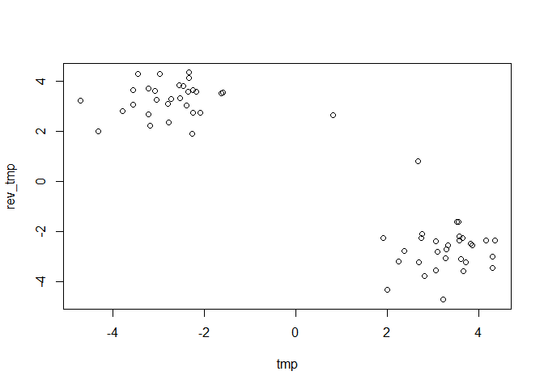
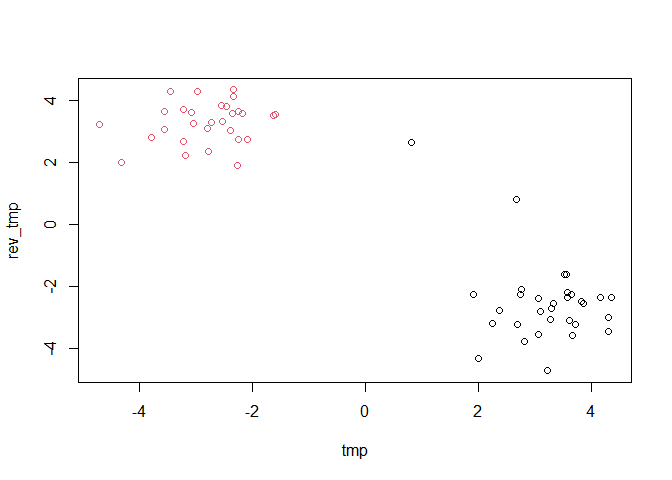

# Class 7
Courtney Cameron PID:A69028599

\#Machine Learning methods using clustering and dimensionality reduction
approaches

\#Kmeans clustering

the main function for k-means in base R is kmeans()

using made up data to determine how kmeans works and to look at how the
results are given

``` r
hist(rnorm(1000))
```


make a vector with 60 points, half centered at +3 and half centered at
-3

``` r
tmp <-c(rnorm(30, mean=3),rnorm(30, mean=-3))
tmp
```

     [1]  2.3615600  4.3445352  3.3292537  1.9090660  3.6152272  4.1470600
     [7]  4.2908487  2.2452124  3.5453738  4.2900912  1.9918069  2.6898789
    [13]  3.6581860  3.6386839  3.0894484  3.5695205  2.8154100  2.7304183
    [19]  3.5109081  3.0511850  3.0635040  2.7530103  3.8251568  3.5734056
    [25]  2.6637132  3.2194596  3.2700966  3.8509715  3.2815666  3.7092524
    [31] -3.2183540 -2.7214839 -2.5567626 -3.0466304 -4.7172760  0.8053767
    [37] -2.1785547 -2.4714752 -2.0955691 -3.5561606 -2.3866833 -1.6245934
    [43] -2.2469129 -3.7835934 -2.3647328 -2.8015093 -2.2495881 -3.5655506
    [49] -3.2221869 -4.3208320 -3.4593353 -1.5960410 -3.1877886 -2.9842014
    [55] -2.3488699 -3.0861860 -2.2654094 -2.5379653 -2.3365646 -2.7766427

make a scatter plot of tmp

``` r
rev_tmp <- rev(tmp)
x <- cbind(tmp, rev_tmp)


plot(x)
```



find kmeans of tmp_df

``` r
k <- kmeans(x, centers=2, nstart=20)
k
```

    K-means clustering with 2 clusters of sizes 30, 30

    Cluster means:
            tmp   rev_tmp
    1 -2.696736  3.267794
    2  3.267794 -2.696736

    Clustering vector:
     [1] 2 2 2 2 2 2 2 2 2 2 2 2 2 2 2 2 2 2 2 2 2 2 2 2 2 2 2 2 2 2 1 1 1 1 1 1 1 1
    [39] 1 1 1 1 1 1 1 1 1 1 1 1 1 1 1 1 1 1 1 1 1 1

    Within cluster sum of squares by cluster:
    [1] 40.06368 40.06368
     (between_SS / total_SS =  93.0 %)

    Available components:

    [1] "cluster"      "centers"      "totss"        "withinss"     "tot.withinss"
    [6] "betweenss"    "size"         "iter"         "ifault"      

What is in the result object

``` r
attributes(k)
```

    $names
    [1] "cluster"      "centers"      "totss"        "withinss"     "tot.withinss"
    [6] "betweenss"    "size"         "iter"         "ifault"      

    $class
    [1] "kmeans"

Whar are the cluster centers

``` r
k$centers
```

            tmp   rev_tmp
    1 -2.696736  3.267794
    2  3.267794 -2.696736

what is the clustering results

``` r
k$cluster
```

     [1] 2 2 2 2 2 2 2 2 2 2 2 2 2 2 2 2 2 2 2 2 2 2 2 2 2 2 2 2 2 2 1 1 1 1 1 1 1 1
    [39] 1 1 1 1 1 1 1 1 1 1 1 1 1 1 1 1 1 1 1 1 1 1

> Q Plot your data ‘x’ showing your clustering results and the center
> point for each cluster?\<

‘points’ can be used to add additional chuncks - will add points to the
previosly exsisting grph with no ‘+’ like in ggplot

``` r
plot(x, col=k$cluster) 
points(k$centers, pch=15, col='green')
```


> Q. run kmeans and cluster in 3 groups and plot the results?

``` r
k2<- kmeans(x, centers=3, nstart=20 )

plot(x, col=k2$cluster)
points(k2$centers, pch=15, col='blue')
```


a greater number of centers yeilds a lower sum of squares

``` r
k$tot.withinss
```

    [1] 80.12735

``` r
k2$tot.withinss
```

    [1] 57.45034

The major limitation of kmeans is that it imposes structure on the data,
it will cluster based on the number of groups specified regardless if
that is the best structure

\#Hierarchical Clusterin hclust() doesn’t want the data, it was a
distance matrix found by dist() in base R dist() measures euclidian
distance by default - symetrical matrix the determines distance between
all values

``` r
d<- dist(x)
d
```

                 1           2           3           4           5           6
    2   2.03122116                                                            
    3   0.99669355  1.03506460                                                
    4   0.68272273  2.43650841  1.44610508                                    
    5   1.29131662  1.04585960  0.61832576  1.89331994                        
    6   1.83602829  0.19785820  0.83938323  2.23954970  0.90911003            
    7   1.94042146  0.64985817  1.06009032  2.48788076  0.68327533  0.65139944
    8   0.42729110  2.26533408  1.26388918  0.98172183  1.37377720  2.07865554
    9   1.67189579  1.08951102  0.96640022  1.76792453  1.49178139  0.96373119
    10  2.04580103  1.12408991  1.33121422  2.66359534  0.77115613  1.11963887
    11  1.58784069  3.07776667  2.22876148  2.05708736  2.03956968  2.92125838
    12  0.55344640  1.87675633  0.93646106  1.23494614  0.93528916  1.69884058
    13  1.51776633  1.40765115  1.07894760  2.17940082  0.48128565  1.31122447
    14  1.38160488  0.71118983  0.42297574  1.72969025  0.83692669  0.51797989
    15  0.72831302  1.33843809  0.35631735  1.29642035  0.59789983  1.15040202
    16  1.27625955  0.77552639  0.29620542  1.66342249  0.72289960  0.57775729
    17  1.10450423  2.10525922  1.34745122  1.76814655  1.06117143  1.95747882
    18  0.64549991  1.61660473  0.66581935  0.82156052  1.21953526  1.42030597
    19  1.62733483  1.09628332  0.93126074  1.72526613  1.46531067  0.96398431
    20  0.79224426  1.29432092  0.31655721  1.14853957  0.89858092  1.09652721
    21  1.04898687  1.76874398  1.05230436  1.73169445  0.72475834  1.62223436
    22  0.78555365  1.60966775  0.72647838  0.86086450  1.31329347  1.41687539
    23  1.49507281  0.53661422  0.50034065  1.92713958  0.64956886  0.34446155
    24  1.35139894  0.78715182  0.43449530  1.66660435  0.90859434  0.59840344
    25  3.59474054  3.56327907  3.40894119  3.16215425  4.00620008  3.48562614
    26  2.12180329  2.63316953  2.18207463  2.78006855  1.67841789  2.54357814
    27  0.94780384  1.28787102  0.51209349  1.56930257  0.34739000  1.12068485
    28  1.50555436  0.54045561  0.52205630  1.96364041  0.57953818  0.36178413
    29  0.92165865  1.13051539  0.18961307  1.44629245  0.49430462  0.94229506
    30  1.41823259  1.08680115  0.77931235  2.03685407  0.16220084  0.97348756
    31  8.55583280  9.68241684  9.04980086  7.87318352  9.63720991  9.53677983
    32  7.90817517  9.02729325  8.39514007  7.22571341  8.98343923  8.88136873
    33  8.25319130  9.26895431  8.68698460  7.57322519  9.28534394  9.13122506
    34  8.11243362  9.27706735  8.62470181  7.42972092  9.20775082  9.12808669
    35  9.27702326 10.62947911  9.89416905  8.60187160 10.44948684 10.46817777
    36  5.65854919  6.12604450  5.78164465  5.05117606  6.39973444  6.02435368
    37  7.80613568  8.80218434  8.22707770  7.12744013  8.82712120  8.66526102
    38  8.18180821  9.18829737  8.61032979  7.50227548  9.20948455  9.05116648
    39  7.10232796  8.20845398  7.57780484  6.42040798  8.16758279  8.06223299
    40  8.31424858  9.56983458  8.87611333  7.63321810  9.44708893  9.41453123
    41  7.51727275  8.62189933  7.99440661  6.83517647  8.58430267  8.47646122
    42  7.44464330  8.35604172  7.81853381  6.77145422  8.42480686  8.22490011
    43  7.18092908  8.31393427  7.67134274  6.49849629  8.25818210  8.16590827
    44  8.30866796  9.62337346  8.90231550  7.63027499  9.46421586  9.46388138
    45  7.91275115  8.93846286  8.35002188  7.23268711  8.94753323  8.79947674
    46  7.81462149  8.97260103  8.32190124  7.13190166  8.90578283  8.82371361
    47  7.90057602  8.89865474  8.32312868  7.22168407  8.92300024  8.76172971
    48  8.74858044  9.92504366  9.26987687  8.06600326  9.85140210  9.77594410
    49  7.81415940  9.08407492  8.38163044  7.13334688  8.95059535  8.92719381
    50  8.20929196  9.68624741  8.89059324  7.54556292  9.42162663  9.51560145
    51  9.15541095 10.23782016  9.62846283  8.47315289 10.22051368 10.09619009
    52  7.45858547  8.35988301  7.82723080  6.78608689  8.43415086  8.22953933
    53  7.48427001  8.81638142  8.08397357  6.80614684  8.64319572  8.65480189
    54  8.86152350  9.88094058  9.30012988  8.18098925  9.89813611  9.74375453
    55  8.37411542  9.31874779  8.77101202  7.69738799  9.37498281  9.18663223
    56  8.39844850  9.52047495  8.88929947  7.71585570  9.47722945  9.37498281
    57  6.58518878  7.85600065  7.14677147  5.90359967  7.71585570  7.69738799
    58  7.82862179  8.91461219  8.29750073  7.14677147  8.88929947  8.77101202
    59  8.53132751  9.44850195  8.91461219  7.85600065  9.52047495  9.31874779
    60  7.26651591  8.53132751  7.82862179  6.58518878  8.39844850  8.37411542
                 7           8           9          10          11          12
    2                                                                         
    3                                                                         
    4                                                                         
    5                                                                         
    6                                                                         
    7                                                                         
    8   2.05574210                                                            
    9   1.57566565  2.05525669                                                
    10  0.47513449  2.06282987  2.00660654                                    
    11  2.65935604  1.16103482  3.13656762  2.45444239                        
    12  1.61856151  0.44599501  1.83744988  1.61768935  1.30166265            
    13  0.85920251  1.46259993  1.97273789  0.64076977  1.82955441  1.02738370
    14  0.98233173  1.67987589  0.66017468  1.37397955  2.64617751  1.35874185
    15  1.21521153  0.92841050  1.28880641  1.36904280  1.87434209  0.58019426
    16  0.95081841  1.55923471  0.76907099  1.31048722  2.51306677  1.22841237
    17  1.67807837  0.82468705  2.30612943  1.50990997  0.98333480  0.57526982
    18  1.72584396  1.05861789  1.04297012  1.97548672  2.20151936  0.97611621
    19  1.56743139  2.01135893  0.04475627  1.99333993  3.09473282  1.79621655
    20  1.37615186  1.13638087  0.93238290  1.63874065  2.20526943  0.91027926
    21  1.35407248  0.89738457  2.01848144  1.23040293  1.31653222  0.50113284
    22  1.77612333  1.20449242  0.93667938  2.05486636  2.35185577  1.12838517
    23  0.69264497  1.73474178  0.91905588  1.09180195  2.60409145  1.36103778
    24  1.07879155  1.66812779  0.58318779  1.46766388  2.66285689  1.36740180
    25  4.12413287  4.01503571  2.55815013  4.56430429  5.17005553  4.02764858
    26  2.03750390  1.81341924  3.13820460  1.65186771  1.29007707  1.58611068
    27  1.02265938  1.03455945  1.47647800  1.10032465  1.80488623  0.60619523
    28  0.61334808  1.72529886  1.00815475  1.00372486  2.56289564  1.33825468
    29  1.04291457  1.13642868  1.15594807  1.24961858  2.05460329  0.77511152
    30  0.62696226  1.46435904  1.63056916  0.62884474  2.04085200  1.01938071
    31 10.05934630  8.79884829  8.59617069 10.38101143  9.57225325  9.10780248
    32  9.40386388  8.15601787  7.94131978  9.72635302  8.94491893  8.46059431
    33  9.67519344  8.52074566  8.17960956 10.01598682  9.35242520  8.80663477
    34  9.64130916  8.34912453  8.19352266  9.95553802  9.11087524  8.66356066
    35 10.93762857  9.46198036  9.56349444 11.21333866 10.09295745  9.81635125
    36  6.63682562  6.02604347  5.06488791  7.04520817  7.08459520  6.18022399
    37  9.21169848  8.07981814  7.71275141  9.55525110  8.92809629  8.35952883
    38  9.59668605  8.45154093  8.09887997  9.93894387  9.28859628  8.73525208
    39  8.58498285  7.35768138  7.12281432  8.90897838  8.16981569  7.65529191
    40  9.90708301  8.52845743  8.49371229 10.20348463  9.23625254  8.86131582
    41  9.00085117  7.77040850  7.53564927  9.32556657  8.57425281  8.07011017
    42  8.78515237  7.73614462  7.26701377  9.14154182  8.62638421  7.99682682
    43  8.68327149  7.42996374  7.22971879  9.00252583  8.22720342  7.73339646
    44  9.94143385  8.50793111  8.55421880 10.22530251  9.18047922  8.85202911
    45  9.34066568  8.18002569  7.84935569  9.67943677  9.01316267  8.46619091
    46  9.33759945  8.05438411  7.88902626  9.65284235  8.82542555  8.36612718
    47  9.30805684  8.17336877  7.80922063  9.65138752  9.01905344  8.45398613
    48 10.28806684  8.97955085  8.84150133 10.60048192  9.72362847  9.29892083
    49  9.41492911  8.02741734  8.01055466  9.70809749  8.73703603  8.36092358
    50  9.94593902  8.36308245  8.64579931 10.19131738  8.92741958  8.73703603
    51 10.62923723  9.40534686  9.14945357 10.95934404 10.19131738  9.70809749
    52  8.79151984  7.75181927  7.27105843  9.14945357  8.64579931  8.01055466
    53  9.12561138  7.68342360  7.75181927  9.40534686  8.36308245  8.02741734
    54 10.28847446  9.12561138  8.79151984 10.62923723  9.94593902  9.41492911
    55  9.74375453  8.65480189  8.22953933 10.09619009  9.51560145  8.92719381
    56  9.89813611  8.64319572  8.43415086 10.22051368  9.42162663  8.95059535
    57  8.18098925  6.80614684  6.78608689  8.47315289  7.54556292  7.13334688
    58  9.30012988  8.08397357  7.82723080  9.62846283  8.89059324  8.38163044
    59  9.88094058  8.81638142  8.35988301 10.23782016  9.68624741  9.08407492
    60  8.86152350  7.48427001  7.45858547  9.15541095  8.20929196  7.81415940
                13          14          15          16          17          18
    2                                                                         
    3                                                                         
    4                                                                         
    5                                                                         
    6                                                                         
    7                                                                         
    8                                                                         
    9                                                                         
    10                                                                        
    11                                                                        
    12                                                                        
    13                                                                        
    14  1.31610702                                                            
    15  0.95248176  0.77863775                                                
    16  1.20408678  0.13432005  0.64903238                                    
    17  0.87052519  1.74096307  1.01960101  1.60681308                        
    18  1.61231460  0.90826955  0.66066622  0.84733353  1.53902916            
    19  1.94653681  0.63792239  1.25010376  0.74245654  2.26825897  0.99822136
    20  1.32596316  0.60328275  0.41658700  0.51880012  1.41666784  0.34989578
    21  0.59475614  1.42757263  0.75509706  1.29443149  0.33656552  1.35095359
    22  1.72632223  0.89896580  0.78201158  0.85973135  1.68917722  0.15302065
    23  1.10674301  0.28983798  0.80634320  0.27702679  1.65566988  1.11753328
    24  1.38958462  0.09647279  0.78885178  0.18621865  1.77502306  0.84575438
    25  4.48263109  3.20677058  3.63192474  3.29698059  4.59147676  3.05301837
    26  1.23245781  2.50304468  1.92017310  2.37844533  1.01735892  2.51830405
    27  0.64799038  0.87814184  0.30449650  0.74474094  0.86594135  0.96478020
    28  1.02704406  0.37339283  0.79988653  0.34071997  1.60545995  1.16260327
    29  0.92427853  0.59179253  0.20811893  0.45846352  1.15990463  0.72731156
    30  0.35093198  0.97133276  0.74693808  0.86498217  1.05756792  1.37906275
    31 10.01047253  9.08442337  9.06522966  9.10870661  9.62024146  8.41806367
    32  9.35858969  8.42884367  8.41253506  8.45324984  8.97628427  7.76449110
    33  9.67627952  8.69484812  8.72554865  8.72733203  9.33524608  8.07084104
    34  9.57500052  8.66950667  8.63225701  8.69049798  9.17158983  7.98822162
    35 10.77890187  9.98661840  9.85885446  9.99270735 10.28514018  9.23847266
    36  6.85144134  5.67169809  5.92331335  5.73809727  6.75336929  5.27446999
    37  9.22129257  8.23088814  8.26990909  8.26449367  8.89185680  7.61407396
    38  9.60183846  8.61606461  8.65081355  8.64918276  9.26521639  7.99560665
    39  8.54575391  7.60970751  7.59849295  7.63443091  8.17587330  6.94905651
    40  9.79750786  8.94397750  8.86354889  8.95773883  9.35305584  8.22931348
    41  8.96223377  8.02516322  8.01511377  8.05037447  8.58929393  7.36577011
    42  8.83085645  7.80290997  7.87837570  7.84231951  8.53951886  7.21932330
    43  8.63188370  7.70978030  7.68628482  7.73249388  8.24981581  7.03900920
    44  9.80289438  8.98578909  8.87628785  8.99456300  9.33240009  8.24981581
    45  9.33727959  8.36080358  8.38678207  8.39230150  8.99456300  7.73249388
    46  9.27451749  8.36548856  8.33107228  8.38678207  8.87628785  7.68628482
    47  9.31680141  8.32727406  8.36548856  8.36080358  8.98578909  7.70978030
    48 10.21590622  9.31680141  9.27451749  9.33727959  9.80289438  8.63188370
    49  9.29892083  8.45398613  8.36612718  8.46619091  8.85202911  7.73339646
    50  9.72362847  9.01905344  8.82542555  9.01316267  9.18047922  8.22720342
    51 10.60048192  9.65138752  9.65284235  9.67943677 10.22530251  9.00252583
    52  8.84150133  7.80922063  7.88902626  7.84935569  8.55421880  7.22971879
    53  8.97955085  8.17336877  8.05438411  8.18002569  8.50793111  7.42996374
    54 10.28806684  9.30805684  9.33759945  9.34066568  9.94143385  8.68327149
    55  9.77594410  8.76172971  8.82371361  8.79947674  9.46388138  8.16590827
    56  9.85140210  8.92300024  8.90578283  8.94753323  9.46421586  8.25818210
    57  8.06600326  7.22168407  7.13190166  7.23268711  7.63027499  6.49849629
    58  9.26987687  8.32312868  8.32190124  8.35002188  8.90231550  7.67134274
    59  9.92504366  8.89865474  8.97260103  8.93846286  9.62337346  8.31393427
    60  8.74858044  7.90057602  7.81462149  7.91275115  8.30866796  7.18092908
                19          20          21          22          23          24
    2                                                                         
    3                                                                         
    4                                                                         
    5                                                                         
    6                                                                         
    7                                                                         
    8                                                                         
    9                                                                         
    10                                                                        
    11                                                                        
    12                                                                        
    13                                                                        
    14                                                                        
    15                                                                        
    16                                                                        
    17                                                                        
    18                                                                        
    19                                                                        
    20  0.89001481                                                            
    21  1.98270575  1.16954213                                                
    22  0.89231565  0.41672003  1.49322924                                    
    23  0.90330564  0.77860259  1.32538945  1.13613530                        
    24  0.55747557  0.56216716  1.46894441  0.82458173  0.38623972            
    25  2.57342066  3.21549086  4.37982190  2.90231990  3.47659457  3.11951705
    26  3.10638500  2.33665970  1.17154222  2.66287844  2.32604601  2.56327598
    27  1.44228272  0.69530747  0.54981949  1.08254133  0.79930925  0.91953895
    28  0.99226130  0.81767074  1.27236057  1.19088965  0.08910853  0.46913117
    29  1.12060974  0.40640756  0.86269142  0.81923194  0.59832648  0.61639445
    30  1.60605519  1.06053234  0.72876903  1.47480328  0.75581855  1.04863578
    31  8.58678515  8.74457265  9.60458040  8.32785354  9.37082909  8.98856330
    32  7.93177884  8.09028815  8.95659515  7.67356991  8.71527360  8.33298010
    33  8.17303117  8.38793259  9.29801061  7.97214110  8.98344184  8.59849682
    34  8.18286633  8.31760249  9.16141521  7.90102532  8.95472534  8.57395341
    35  9.54818633  9.58007428 10.31743981  9.16813543 10.26449687  9.89312683
    36  5.07045105  5.52721991  6.61709669  5.14237741  5.95728396  5.57759287
    37  7.70643758  7.92923933  8.84928767  7.51382777  8.51969103  8.13450021
    38  8.09250810  8.31184293  9.22604142  7.89621711  8.90478238  8.51969103
    39  7.11308663  7.27361866  8.14994923  6.85692682  7.89621711  7.51382777
    40  8.48066721  8.56513609  9.36161934  8.14994923  9.22604142  8.84928767
    41  7.52625324  7.69030707  8.56513609  7.27361866  8.31184293  7.92923933
    42  7.26269588  7.52625324  8.48066721  7.11308663  8.09250810  7.70643758
    43  7.21932330  7.36577011  8.22931348  6.94905651  7.99560665  7.61407396
    44  8.53951886  8.58929393  9.35305584  8.17587330  9.26521639  8.89185680
    45  7.84231951  8.05037447  8.95773883  7.63443091  8.64918276  8.26449367
    46  7.87837570  8.01511377  8.86354889  7.59849295  8.65081355  8.26990909
    47  7.80290997  8.02516322  8.94397750  7.60970751  8.61606461  8.23088814
    48  8.83085645  8.96223377  9.79750786  8.54575391  9.60183846  9.22129257
    49  7.99682682  8.07011017  8.86131582  7.65529191  8.73525208  8.35952883
    50  8.62638421  8.57425281  9.23625254  8.16981569  9.28859628  8.92809629
    51  9.14154182  9.32556657 10.20348463  8.90897838  9.93894387  9.55525110
    52  7.26701377  7.53564927  8.49371229  7.12281432  8.09887997  7.71275141
    53  7.73614462  7.77040850  8.52845743  7.35768138  8.45154093  8.07981814
    54  8.78515237  9.00085117  9.90708301  8.58498285  9.59668605  9.21169848
    55  8.22490011  8.47646122  9.41453123  8.06223299  9.05116648  8.66526102
    56  8.42480686  8.58430267  9.44708893  8.16758279  9.20948455  8.82712120
    57  6.77145422  6.83517647  7.63321810  6.42040798  7.50227548  7.12744013
    58  7.81853381  7.99440661  8.87611333  7.57780484  8.61032979  8.22707770
    59  8.35604172  8.62189933  9.56983458  8.20845398  9.18829737  8.80218434
    60  7.44464330  7.51727275  8.31424858  7.10232796  8.18180821  7.80613568
                25          26          27          28          29          30
    2                                                                         
    3                                                                         
    4                                                                         
    5                                                                         
    6                                                                         
    7                                                                         
    8                                                                         
    9                                                                         
    10                                                                        
    11                                                                        
    12                                                                        
    13                                                                        
    14                                                                        
    15                                                                        
    16                                                                        
    17                                                                        
    18                                                                        
    19                                                                        
    20                                                                        
    21                                                                        
    22                                                                        
    23                                                                        
    24                                                                        
    25                                                                        
    26  5.55054471                                                            
    27  3.89944350  1.67141279                                                
    28  3.56560833  2.25091659  0.75985930                                    
    29  3.58057094  1.99675824  0.32534880  0.59275209                        
    30  4.15735022  1.57691602  0.47153665  0.67659996  0.65558757            
    31  6.55981773 10.60433041  9.36706695  9.44660290  9.14348600  9.79711489
    32  5.92721385  9.96374885  8.71464936  8.79108963  8.48959537  9.14348600
    33  6.04392383 10.33342184  9.02935212  9.06190443  8.79108963  9.44660290
    34  6.21955533 10.15194581  8.93320098  9.02935212  8.71464936  9.36706695
    35  7.76574514 11.22423902 10.15194581 10.33342184  9.96374885 10.60433041
    36  2.62808471  7.76574514  6.21955533  6.04392383  5.92721385  6.55981773
    37  5.57759287  9.89312683  8.57395341  8.59849682  8.33298010  8.98856330
    38  5.95728396 10.26449687  8.95472534  8.98344184  8.71527360  9.37082909
    39  5.14237741  9.16813543  7.90102532  7.97214110  7.67356991  8.32785354
    40  6.61709669 10.31743981  9.16141521  9.29801061  8.95659515  9.60458040
    41  5.52721991  9.58007428  8.31760249  8.38793259  8.09028815  8.74457265
    42  5.07045105  9.54818633  8.18286633  8.17303117  7.93177884  8.58678515
    43  5.27446999  9.23847266  7.98822162  8.07084104  7.76449110  8.41806367
    44  6.75336929 10.28514018  9.17158983  9.33524608  8.97628427  9.62024146
    45  5.73809727  9.99270735  8.69049798  8.72733203  8.45324984  9.10870661
    46  5.92331335  9.85885446  8.63225701  8.72554865  8.41253506  9.06522966
    47  5.67169809  9.98661840  8.66950667  8.69484812  8.42884367  9.08442337
    48  6.85144134 10.77890187  9.57500052  9.67627952  9.35858969 10.01047253
    49  6.18022399  9.81635125  8.66356066  8.80663477  8.46059431  9.10780248
    50  7.08459520 10.09295745  9.11087524  9.35242520  8.94491893  9.57225325
    51  7.04520817 11.21333866  9.95553802 10.01598682  9.72635302 10.38101143
    52  5.06488791  9.56349444  8.19352266  8.17960956  7.94131978  8.59617069
    53  6.02604347  9.46198036  8.34912453  8.52074566  8.15601787  8.79884829
    54  6.63682562 10.93762857  9.64130916  9.67519344  9.40386388 10.05934630
    55  6.02435368 10.46817777  9.12808669  9.13122506  8.88136873  9.53677983
    56  6.39973444 10.44948684  9.20775082  9.28534394  8.98343923  9.63720991
    57  5.05117606  8.60187160  7.42972092  7.57322519  7.22571341  7.87318352
    58  5.78164465  9.89416905  8.62470181  8.68698460  8.39514007  9.04980086
    59  6.12604450 10.62947911  9.27706735  9.26895431  9.02729325  9.68241684
    60  5.65854919  9.27702326  8.11243362  8.25319130  7.90817517  8.55583280
                31          32          33          34          35          36
    2                                                                         
    3                                                                         
    4                                                                         
    5                                                                         
    6                                                                         
    7                                                                         
    8                                                                         
    9                                                                         
    10                                                                        
    11                                                                        
    12                                                                        
    13                                                                        
    14                                                                        
    15                                                                        
    16                                                                        
    17                                                                        
    18                                                                        
    19                                                                        
    20                                                                        
    21                                                                        
    22                                                                        
    23                                                                        
    24                                                                        
    25                                                                        
    26                                                                        
    27                                                                        
    28                                                                        
    29                                                                        
    30                                                                        
    31                                                                        
    32  0.65558757                                                            
    33  0.67659996  0.59275209                                                
    34  0.47153665  0.32534880  0.75985930                                    
    35  1.57691602  1.99675824  2.25091659  1.67141279                        
    36  4.15735022  3.58057094  3.56560833  3.89944350  5.55054471            
    37  1.04863578  0.61639445  0.46913117  0.91953895  2.56327598  3.11951705
    38  0.75581855  0.59832648  0.08910853  0.79930925  2.32604601  3.47659457
    39  1.47480328  0.81923194  1.19088965  1.08254133  2.66287844  2.90231990
    40  0.72876903  0.86269142  1.27236057  0.54981949  1.17154222  4.37982190
    41  1.06053234  0.40640756  0.81767074  0.69530747  2.33665970  3.21549086
    42  1.60605519  1.12060974  0.99226130  1.44228272  3.10638500  2.57342066
    43  1.37906275  0.72731156  1.16260327  0.96478020  2.51830405  3.05301837
    44  1.05756792  1.15990463  1.60545995  0.86594135  1.01735892  4.59147676
    45  0.86498217  0.45846352  0.34071997  0.74474094  2.37844533  3.29698059
    46  0.74693808  0.20811893  0.79988653  0.30449650  1.92017310  3.63192474
    47  0.97133276  0.59179253  0.37339283  0.87814184  2.50304468  3.20677058
    48  0.35093198  0.92427853  1.02704406  0.64799038  1.23245781  4.48263109
    49  1.01938071  0.77511152  1.33825468  0.60619523  1.58611068  4.02764858
    50  2.04085200  2.05460329  2.56289564  1.80488623  1.29007707  5.17005553
    51  0.62884474  1.24961858  1.00372486  1.10032465  1.65186771  4.56430429
    52  1.63056916  1.15594807  1.00815475  1.47647800  3.13820460  2.55815013
    53  1.46435904  1.13642868  1.72529886  1.03455945  1.81341924  4.01503571
    54  0.62696226  1.04291457  0.61334808  1.02265938  2.03750390  4.12413287
    55  0.97348756  0.94229506  0.36178413  1.12068485  2.54357814  3.48562614
    56  0.16220084  0.49430462  0.57953818  0.34739000  1.67841789  4.00620008
    57  2.03685407  1.44629245  1.96364041  1.56930257  2.78006855  3.16215425
    58  0.77931235  0.18961307  0.52205630  0.51209349  2.18207463  3.40894119
    59  1.08680115  1.13051539  0.54045561  1.28787102  2.63316953  3.56327907
    60  1.41823259  0.92165865  1.50555436  0.94780384  2.12180329  3.59474054
                37          38          39          40          41          42
    2                                                                         
    3                                                                         
    4                                                                         
    5                                                                         
    6                                                                         
    7                                                                         
    8                                                                         
    9                                                                         
    10                                                                        
    11                                                                        
    12                                                                        
    13                                                                        
    14                                                                        
    15                                                                        
    16                                                                        
    17                                                                        
    18                                                                        
    19                                                                        
    20                                                                        
    21                                                                        
    22                                                                        
    23                                                                        
    24                                                                        
    25                                                                        
    26                                                                        
    27                                                                        
    28                                                                        
    29                                                                        
    30                                                                        
    31                                                                        
    32                                                                        
    33                                                                        
    34                                                                        
    35                                                                        
    36                                                                        
    37                                                                        
    38  0.38623972                                                            
    39  0.82458173  1.13613530                                                
    40  1.46894441  1.32538945  1.49322924                                    
    41  0.56216716  0.77860259  0.41672003  1.16954213                        
    42  0.55747557  0.90330564  0.89231565  1.98270575  0.89001481            
    43  0.84575438  1.11753328  0.15302065  1.35095359  0.34989578  0.99822136
    44  1.77502306  1.65566988  1.68917722  0.33656552  1.41666784  2.26825897
    45  0.18621865  0.27702679  0.85973135  1.29443149  0.51880012  0.74245654
    46  0.78885178  0.80634320  0.78201158  0.75509706  0.41658700  1.25010376
    47  0.09647279  0.28983798  0.89896580  1.42757263  0.60328275  0.63792239
    48  1.38958462  1.10674301  1.72632223  0.59475614  1.32596316  1.94653681
    49  1.36740180  1.36103778  1.12838517  0.50113284  0.91027926  1.79621655
    50  2.66285689  2.60409145  2.35185577  1.31653222  2.20526943  3.09473282
    51  1.46766388  1.09180195  2.05486636  1.23040293  1.63874065  1.99333993
    52  0.58318779  0.91905588  0.93667938  2.01848144  0.93238290  0.04475627
    53  1.66812779  1.73474178  1.20449242  0.89738457  1.13638087  2.01135893
    54  1.07879155  0.69264497  1.77612333  1.35407248  1.37615186  1.56743139
    55  0.59840344  0.34446155  1.41687539  1.62223436  1.09652721  0.96398431
    56  0.90859434  0.64956886  1.31329347  0.72475834  0.89858092  1.46531067
    57  1.66660435  1.92713958  0.86086450  1.73169445  1.14853957  1.72526613
    58  0.43449530  0.50034065  0.72647838  1.05230436  0.31655721  0.93126074
    59  0.78715182  0.53661422  1.60966775  1.76874398  1.29432092  1.09628332
    60  1.35139894  1.49507281  0.78555365  1.04898687  0.79224426  1.62733483
                43          44          45          46          47          48
    2                                                                         
    3                                                                         
    4                                                                         
    5                                                                         
    6                                                                         
    7                                                                         
    8                                                                         
    9                                                                         
    10                                                                        
    11                                                                        
    12                                                                        
    13                                                                        
    14                                                                        
    15                                                                        
    16                                                                        
    17                                                                        
    18                                                                        
    19                                                                        
    20                                                                        
    21                                                                        
    22                                                                        
    23                                                                        
    24                                                                        
    25                                                                        
    26                                                                        
    27                                                                        
    28                                                                        
    29                                                                        
    30                                                                        
    31                                                                        
    32                                                                        
    33                                                                        
    34                                                                        
    35                                                                        
    36                                                                        
    37                                                                        
    38                                                                        
    39                                                                        
    40                                                                        
    41                                                                        
    42                                                                        
    43                                                                        
    44  1.53902916                                                            
    45  0.84733353  1.60681308                                                
    46  0.66066622  1.01960101  0.64903238                                    
    47  0.90826955  1.74096307  0.13432005  0.77863775                        
    48  1.61231460  0.87052519  1.20408678  0.95248176  1.31610702            
    49  0.97611621  0.57526982  1.22841237  0.58019426  1.35874185  1.02738370
    50  2.20151936  0.98333480  2.51306677  1.87434209  2.64617751  1.82955441
    51  1.97548672  1.50990997  1.31048722  1.36904280  1.37397955  0.64076977
    52  1.04297012  2.30612943  0.76907099  1.28880641  0.66017468  1.97273789
    53  1.05861789  0.82468705  1.55923471  0.92841050  1.67987589  1.46259993
    54  1.72584396  1.67807837  0.95081841  1.21521153  0.98233173  0.85920251
    55  1.42030597  1.95747882  0.57775729  1.15040202  0.51797989  1.31122447
    56  1.21953526  1.06117143  0.72289960  0.59789983  0.83692669  0.48128565
    57  0.82156052  1.76814655  1.66342249  1.29642035  1.72969025  2.17940082
    58  0.66581935  1.34745122  0.29620542  0.35631735  0.42297574  1.07894760
    59  1.61660473  2.10525922  0.77552639  1.33843809  0.71118983  1.40765115
    60  0.64549991  1.10450423  1.27625955  0.72831302  1.38160488  1.51776633
                49          50          51          52          53          54
    2                                                                         
    3                                                                         
    4                                                                         
    5                                                                         
    6                                                                         
    7                                                                         
    8                                                                         
    9                                                                         
    10                                                                        
    11                                                                        
    12                                                                        
    13                                                                        
    14                                                                        
    15                                                                        
    16                                                                        
    17                                                                        
    18                                                                        
    19                                                                        
    20                                                                        
    21                                                                        
    22                                                                        
    23                                                                        
    24                                                                        
    25                                                                        
    26                                                                        
    27                                                                        
    28                                                                        
    29                                                                        
    30                                                                        
    31                                                                        
    32                                                                        
    33                                                                        
    34                                                                        
    35                                                                        
    36                                                                        
    37                                                                        
    38                                                                        
    39                                                                        
    40                                                                        
    41                                                                        
    42                                                                        
    43                                                                        
    44                                                                        
    45                                                                        
    46                                                                        
    47                                                                        
    48                                                                        
    49                                                                        
    50  1.30166265                                                            
    51  1.61768935  2.45444239                                                
    52  1.83744988  3.13656762  2.00660654                                    
    53  0.44599501  1.16103482  2.06282987  2.05525669                        
    54  1.61856151  2.65935604  0.47513449  1.57566565  2.05574210            
    55  1.69884058  2.92125838  1.11963887  0.96373119  2.07865554  0.65139944
    56  0.93528916  2.03956968  0.77115613  1.49178139  1.37377720  0.68327533
    57  1.23494614  2.05708736  2.66359534  1.76792453  0.98172183  2.48788076
    58  0.93646106  2.22876148  1.33121422  0.96640022  1.26388918  1.06009032
    59  1.87675633  3.07776667  1.12408991  1.08951102  2.26533408  0.64985817
    60  0.55344640  1.58784069  2.04580103  1.67189579  0.42729110  1.94042146
                55          56          57          58          59
    2                                                             
    3                                                             
    4                                                             
    5                                                             
    6                                                             
    7                                                             
    8                                                             
    9                                                             
    10                                                            
    11                                                            
    12                                                            
    13                                                            
    14                                                            
    15                                                            
    16                                                            
    17                                                            
    18                                                            
    19                                                            
    20                                                            
    21                                                            
    22                                                            
    23                                                            
    24                                                            
    25                                                            
    26                                                            
    27                                                            
    28                                                            
    29                                                            
    30                                                            
    31                                                            
    32                                                            
    33                                                            
    34                                                            
    35                                                            
    36                                                            
    37                                                            
    38                                                            
    39                                                            
    40                                                            
    41                                                            
    42                                                            
    43                                                            
    44                                                            
    45                                                            
    46                                                            
    47                                                            
    48                                                            
    49                                                            
    50                                                            
    51                                                            
    52                                                            
    53                                                            
    54                                                            
    55                                                            
    56  0.90911003                                                
    57  2.23954970  1.89331994                                    
    58  0.83938323  0.61832576  1.44610508                        
    59  0.19785820  1.04585960  2.43650841  1.03506460            
    60  1.83602829  1.29131662  0.68272273  0.99669355  2.03122116

``` r
hc<-hclust(dist(x))
hc
```


    Call:
    hclust(d = dist(x))

    Cluster method   : complete 
    Distance         : euclidean 
    Number of objects: 60 

plotting hc

``` r
plot(hc)
abline(h=9, col='red')
```


to get the cluster membership vector, we need to cut the tree at a given
height of our choosing.

The function to do this is ‘cutree()’ h cuts at a height, k cuts into
that number of clusters

``` r
cutree(hc, h=9)
```

     [1] 1 1 1 1 1 1 1 1 1 1 1 1 1 1 1 1 1 1 1 1 1 1 1 1 1 1 1 1 1 1 2 2 2 2 2 1 2 2
    [39] 2 2 2 2 2 2 2 2 2 2 2 2 2 2 2 2 2 2 2 2 2 2

> Q Plot x, colored with the hclust results

``` r
grps <- cutree(hc, k=2)

plot(x, col=grps)
```



\#Principal Component Analysis (PCA)

PCA of food UK data

data import

``` r
url <- "https://tinyurl.com/UK-foods"
x <- read.csv(url,row.names=1)
```

\#PCA

function to do PCA in base R is prcomp() - foods and columns and
countries as rows the table needs to be transposed

``` r
pca <-prcomp(t(x))
summary(pca)
```

    Importance of components:
                                PC1      PC2      PC3       PC4
    Standard deviation     324.1502 212.7478 73.87622 4.189e-14
    Proportion of Variance   0.6744   0.2905  0.03503 0.000e+00
    Cumulative Proportion    0.6744   0.9650  1.00000 1.000e+00

``` r
attributes(pca)
```

    $names
    [1] "sdev"     "rotation" "center"   "scale"    "x"       

    $class
    [1] "prcomp"

``` r
plot(pca$x[,1],pca$x[,2], xlab='PCA1 (67.4%)', ylab='PCA2 (29%)', col=c('red','green','orange','blue'), pch=15)
abline()
```


> Q1. How many rows and columns are in your new data frame named x? What
> R functions could you use to answer this questions?

``` r
nrow(x)
```

    [1] 17

``` r
ncol(x)
```

    [1] 4

Checking the data - view the first section of the data

``` r
head(x)
```

                   England Wales Scotland N.Ireland
    Cheese             105   103      103        66
    Carcass_meat       245   227      242       267
    Other_meat         685   803      750       586
    Fish               147   160      122        93
    Fats_and_oils      193   235      184       209
    Sugars             156   175      147       139

> Q2. Which approach to solving the ‘row-names problem’ mentioned above
> do you prefer and why? Is one approach more robust than another under
> certain circumstances?

The method done during the read.csv step is simplier and allows for the
merging of two steps rather than having to do a second step to make the
data frame four rows

> Q3. Changing what optional argument in the above barplot() function
> results in the following plot?

Changing beside from true to false will yeild a stacked bar plot based
on country

``` r
barplot(as.matrix(x), beside=T, col=rainbow(nrow(x)))
```


> Q5. Generating all pairwise plots may help somewhat. Can you make
> sense of the following code and resulting figure? What does it mean if
> a given point lies on the diagonal for a given plot?

The pairs plot shows similarity between the two countries where if the
frequency a food is eaten is the same between two countries, it will lie
on the diagonal

one useful plot is a pairs plot

``` r
pairs(x, col=rainbow(17), pch=16)
```


> Q6.What is the main differences between N. Ireland and the other
> countries of the UK in terms of this data-set?

The greatest variation in the data when comparing N.Ireland to the other
countries comes from the ammount of Fresh potatoes, fresh fruit and
acoholic drinks being either noticably higher or lower in frequency.

``` r
pca <-prcomp(t(x))
summary(pca)
```

    Importance of components:
                                PC1      PC2      PC3       PC4
    Standard deviation     324.1502 212.7478 73.87622 4.189e-14
    Proportion of Variance   0.6744   0.2905  0.03503 0.000e+00
    Cumulative Proportion    0.6744   0.9650  1.00000 1.000e+00

> Q7. Complete the code below to generate a plot of PC1 vs PC2. The
> second line adds text labels over the data points.

``` r
plot(pca$x[,1], pca$x[,2], xlab="PC1", ylab="PC2", xlim=c(-270,500))
text(pca$x[,1], pca$x[,2], colnames(x))
```


> Q8. Customize your plot so that the colors of the country names match
> the colors in our UK and Ireland map and table at start of this
> document.

``` r
plot(pca$x[,1], pca$x[,2], xlab="PC1", ylab="PC2", xlim=c(-270,500))
text(pca$x[,1], pca$x[,2], colnames(x),col=c('orange','red','blue','green'))
```


``` r
v <- round( pca$sdev^2/sum(pca$sdev^2) * 100 )
v
```

    [1] 67 29  4  0

``` r
z <- summary(pca)
z$importance
```

                                 PC1       PC2      PC3          PC4
    Standard deviation     324.15019 212.74780 73.87622 4.188568e-14
    Proportion of Variance   0.67444   0.29052  0.03503 0.000000e+00
    Cumulative Proportion    0.67444   0.96497  1.00000 1.000000e+00

``` r
barplot(v, xlab="Principal Component", ylab="Percent Variation")
```


``` r
par(mar=c(10, 3, 0.35, 0))
barplot( pca$rotation[,1], las=2 )
```


> Q9: Generate a similar ‘loadings plot’ for PC2. What two food groups
> feature prominantely and what does PC2 maninly tell us about?

PC2 is mostly affected by the data for fresh potatoes and soft drinks
with fresh potatoes hacing a positive loading score that pushes
N.Ierland to the right while soft drinks has a high negative score that
pushes it to the left of the plot.

``` r
par(mar=c(10, 3, 0.35, 0))
barplot( pca$rotation[,2], las=2 )
```


\#making the plots in ggplot

Basic PCA

``` r
library(ggplot2)
```

    Warning: package 'ggplot2' was built under R version 4.2.3

``` r
df <- as.data.frame(pca$x)
df_lab <- tibble::rownames_to_column(df, "Country")


ggplot(df_lab) + 
  aes(PC1, PC2, col=Country) + 
  geom_point()
```


Making the PCA look nicer

``` r
ggplot(df_lab) + 
  aes(PC1, PC2, col=Country, label=Country) + 
  geom_hline(yintercept = 0, col="gray") +
  geom_vline(xintercept = 0, col="gray") +
  geom_point(show.legend = FALSE) +
  geom_label(hjust=1, nudge_x = -10, show.legend = FALSE) +
  expand_limits(x = c(-300,500)) +
  xlab("PC1 (67.4%)") +
  ylab("PC2 (28%)") +
  theme_bw()
```


Basic loadings graph

``` r
ld <- as.data.frame(pca$rotation)
ld_lab <- tibble::rownames_to_column(ld, "Food")

ggplot(ld_lab) +
  aes(PC1, Food) +
  geom_col() 
```


Loadings graph that looks nicer

``` r
ggplot(ld_lab) +
  aes(PC1, reorder(Food, PC1), bg=PC1) +
  geom_col() + 
  xlab("PC1 Loadings/Contributions") +
  ylab("Food Group") +
  scale_fill_gradient2(low="purple", mid="gray", high="darkgreen", guide=NULL) +
  theme_bw()
```


biplot

``` r
biplot(pca)
```


\#PCA of RNA-sqe Data

``` r
url2 <- "https://tinyurl.com/expression-CSV"
rna.data <- read.csv(url2, row.names=1)
head(rna.data)
```

           wt1 wt2  wt3  wt4 wt5 ko1 ko2 ko3 ko4 ko5
    gene1  439 458  408  429 420  90  88  86  90  93
    gene2  219 200  204  210 187 427 423 434 433 426
    gene3 1006 989 1030 1017 973 252 237 238 226 210
    gene4  783 792  829  856 760 849 856 835 885 894
    gene5  181 249  204  244 225 277 305 272 270 279
    gene6  460 502  491  491 493 612 594 577 618 638

``` r
nrow(rna.data)
```

    [1] 100

``` r
ncol(rna.data)
```

    [1] 10

> Q10: How many genes and samples are in this data set?

there are 100 genes and 10 samples

RNA seq PCA

``` r
pca <- prcomp(t(rna.data), scale=TRUE)
 

plot(pca$x[,1], pca$x[,2], xlab="PC1", ylab="PC2")
```


``` r
summary(pca)
```

    Importance of components:
                              PC1    PC2     PC3     PC4     PC5     PC6     PC7
    Standard deviation     9.6237 1.5198 1.05787 1.05203 0.88062 0.82545 0.80111
    Proportion of Variance 0.9262 0.0231 0.01119 0.01107 0.00775 0.00681 0.00642
    Cumulative Proportion  0.9262 0.9493 0.96045 0.97152 0.97928 0.98609 0.99251
                               PC8     PC9      PC10
    Standard deviation     0.62065 0.60342 3.348e-15
    Proportion of Variance 0.00385 0.00364 0.000e+00
    Cumulative Proportion  0.99636 1.00000 1.000e+00

scree plot

``` r
plot(pca, main="Quick scree plot")
```


scree plot made with info from prcomp function

``` r
pca.var <- pca$sdev^2

pca.var.per <- round(pca.var/sum(pca.var)*100, 1)
pca.var.per
```

     [1] 92.6  2.3  1.1  1.1  0.8  0.7  0.6  0.4  0.4  0.0

``` r
barplot(pca.var.per, main="Scree Plot", 
        names.arg = paste0("PC", 1:10),
        xlab="Principal Component", ylab="Percent Variation")
```


A better looking pca using base R

``` r
colvec <- colnames(rna.data)
colvec[grep("wt", colvec)] <- "red"
colvec[grep("ko", colvec)] <- "blue"

plot(pca$x[,1], pca$x[,2], col=colvec, pch=16,
     xlab=paste0("PC1 (", pca.var.per[1], "%)"),
     ylab=paste0("PC2 (", pca.var.per[2], "%)"))

text(pca$x[,1], pca$x[,2], labels = colnames(rna.data), pos=c(rep(4,5), rep(2,5)))
```


Using ggplot to make better looking graphs

``` r
library(ggplot2)

df <- as.data.frame(pca$x)

ggplot(df) + 
  aes(PC1, PC2) + 
  geom_point()
```


``` r
df$samples <- colnames(rna.data) 
df$condition <- substr(colnames(rna.data),1,2)

p <- ggplot(df) + 
        aes(PC1, PC2, label=samples, col=condition) + 
        geom_label(show.legend = FALSE)
p
```


``` r
p + labs(title="PCA of RNASeq Data",
       subtitle = "PC1 clealy seperates wild-type from knock-out samples",
       x=paste0("PC1 (", pca.var.per[1], "%)"),
       y=paste0("PC2 (", pca.var.per[2], "%)"),
       caption="Class example data") +
     theme_bw()
```


