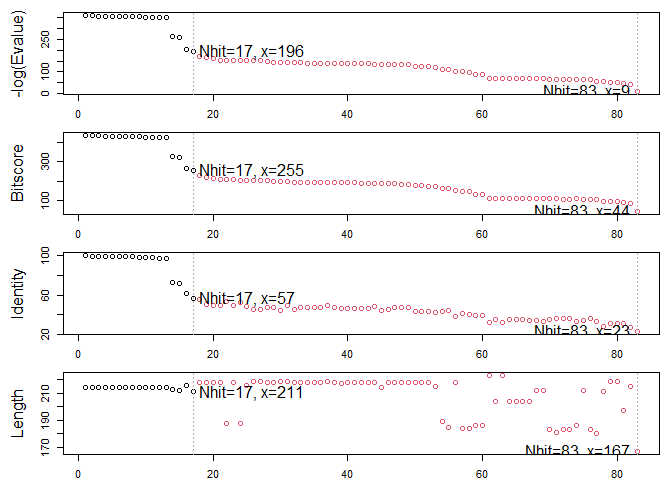
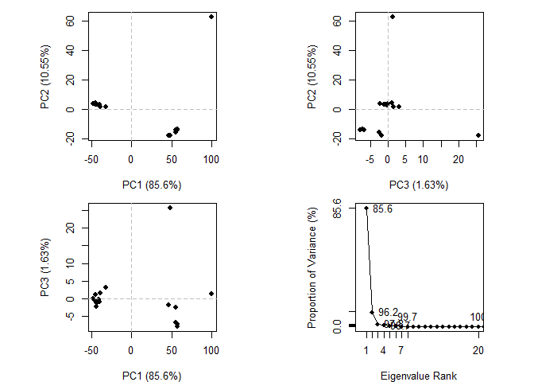

# class 10
Courtney Cameron

# what is in the PDB?

dowload a csv with current commposition data

``` r
pdbstats <- read.csv('pdbsummaru.csv', row.names=1)
```

``` r
head(pdbstats)
```

                              X.ray     EM    NMR Multiple.methods Neutron Other
    Protein (only)          161,663 12,592 12,337              200      74    32
    Protein/Oligosaccharide   9,348  2,167     34                8       2     0
    Protein/NA                8,404  3,924    286                7       0     0
    Nucleic acid (only)       2,758    125  1,477               14       3     1
    Other                       164      9     33                0       0     0
    Oligosaccharide (only)       11      0      6                1       0     4
                              Total
    Protein (only)          186,898
    Protein/Oligosaccharide  11,559
    Protein/NA               12,621
    Nucleic acid (only)       4,378
    Other                       206
    Oligosaccharide (only)       22

testing method

``` r
x <- '2,222'
as.numeric(gsub(',','', x))
```

    [1] 2222

creating into a function to remove comma, convert to numeric and sum the
values

``` r
sumnum <- function(x){
  sum(as.numeric(gsub(',','', x)))
}
```

``` r
sumnum(pdbstats$X.ray)
```

    [1] 182348

``` r
sumnum(pdbstats$EM)
```

    [1] 18817

apply the function to the entrie table and divide by total to get the
percentages

``` r
apply(pdbstats,2,sumnum) / sumnum(pdbstats$Total)
```

               X.ray               EM              NMR Multiple.methods 
        0.8454405519     0.0872433746     0.0657118748     0.0010663749 
             Neutron            Other            Total 
        0.0003662766     0.0001715473     1.0000000000 

> Q1: What percentage of structures in the PDB are solved by X-Ray and
> Electron Microscopy.

84.54% is done using x-ray and 8.7% is done using EM

``` r
apply(pdbstats,1,sumnum) / sum(apply(pdbstats,1,sumnum))
```

             Protein (only) Protein/Oligosaccharide              Protein/NA 
               0.8665362289            0.0535922924            0.0585161625 
        Nucleic acid (only)                   Other  Oligosaccharide (only) 
               0.0202982141            0.0009551010            0.0001020011 

> Q2: What proportion of structures in the PDB are protein?

86% is protien only

> Q3: How does the total number of protein structires in the PDB relate
> to the total number of protein sequences in UniProt?

the PDB database only accounts of 0.0746% of the data avaliable in
Uniprot

``` r
186898/250322721 *100
```

    [1] 0.07466282

# Using Mol\*


> Q4: Water molecules normally have 3 atoms. Why do we see just one atom
> per water molecule in this structure?

> Q5: There is a critical “conserved” water molecule in the binding
> site. Can you identify this water molecule? What residue number does
> this water molecule have

25

> Q6: Generate and save a figure clearly showing the two distinct chains
> of HIV-protease along with the ligand. You might also consider showing
> the catalytic residues ASP 25 in each chain and the critical water (we
> recommend “Ball & Stick” for these side-chains). Add this figure to
> your Quarto document


# working with structures in R

``` r
library(bio3d)
```

    Warning: package 'bio3d' was built under R version 4.2.3

``` r
hiv <-read.pdb("1hsg")
```

      Note: Accessing on-line PDB file

``` r
hiv
```


     Call:  read.pdb(file = "1hsg")

       Total Models#: 1
         Total Atoms#: 1686,  XYZs#: 5058  Chains#: 2  (values: A B)

         Protein Atoms#: 1514  (residues/Calpha atoms#: 198)
         Nucleic acid Atoms#: 0  (residues/phosphate atoms#: 0)

         Non-protein/nucleic Atoms#: 172  (residues: 128)
         Non-protein/nucleic resid values: [ HOH (127), MK1 (1) ]

       Protein sequence:
          PQITLWQRPLVTIKIGGQLKEALLDTGADDTVLEEMSLPGRWKPKMIGGIGGFIKVRQYD
          QILIEICGHKAIGTVLVGPTPVNIIGRNLLTQIGCTLNFPQITLWQRPLVTIKIGGQLKE
          ALLDTGADDTVLEEMSLPGRWKPKMIGGIGGFIKVRQYDQILIEICGHKAIGTVLVGPTP
          VNIIGRNLLTQIGCTLNF

    + attr: atom, xyz, seqres, helix, sheet,
            calpha, remark, call

``` r
head(hiv$atom)
```

      type eleno elety  alt resid chain resno insert      x      y     z o     b
    1 ATOM     1     N <NA>   PRO     A     1   <NA> 29.361 39.686 5.862 1 38.10
    2 ATOM     2    CA <NA>   PRO     A     1   <NA> 30.307 38.663 5.319 1 40.62
    3 ATOM     3     C <NA>   PRO     A     1   <NA> 29.760 38.071 4.022 1 42.64
    4 ATOM     4     O <NA>   PRO     A     1   <NA> 28.600 38.302 3.676 1 43.40
    5 ATOM     5    CB <NA>   PRO     A     1   <NA> 30.508 37.541 6.342 1 37.87
    6 ATOM     6    CG <NA>   PRO     A     1   <NA> 29.296 37.591 7.162 1 38.40
      segid elesy charge
    1  <NA>     N   <NA>
    2  <NA>     C   <NA>
    3  <NA>     C   <NA>
    4  <NA>     O   <NA>
    5  <NA>     C   <NA>
    6  <NA>     C   <NA>

> Q7: How many amino acid residues are there in this pdb object?

> Q8: Name one of the two non-protein residues?

MK1

> Q9: How many protein chains are in this structure?

2

# Predicting functional motions of a single structure

``` r
adk <- read.pdb("6s36")
```

      Note: Accessing on-line PDB file
       PDB has ALT records, taking A only, rm.alt=TRUE

``` r
adk
```


     Call:  read.pdb(file = "6s36")

       Total Models#: 1
         Total Atoms#: 1898,  XYZs#: 5694  Chains#: 1  (values: A)

         Protein Atoms#: 1654  (residues/Calpha atoms#: 214)
         Nucleic acid Atoms#: 0  (residues/phosphate atoms#: 0)

         Non-protein/nucleic Atoms#: 244  (residues: 244)
         Non-protein/nucleic resid values: [ CL (3), HOH (238), MG (2), NA (1) ]

       Protein sequence:
          MRIILLGAPGAGKGTQAQFIMEKYGIPQISTGDMLRAAVKSGSELGKQAKDIMDAGKLVT
          DELVIALVKERIAQEDCRNGFLLDGFPRTIPQADAMKEAGINVDYVLEFDVPDELIVDKI
          VGRRVHAPSGRVYHVKFNPPKVEGKDDVTGEELTTRKDDQEETVRKRLVEYHQMTAPLIG
          YYSKEAEAGNTKYAKVDGTKPVAEVRADLEKILG

    + attr: atom, xyz, seqres, helix, sheet,
            calpha, remark, call

Normal mode analysis (nma) - predicts functional motions and large-scale
stucture changes

``` r
m <- nma(adk)
```

     Building Hessian...        Done in 0.07 seconds.
     Diagonalizing Hessian...   Done in 0.6 seconds.

``` r
plot(m)
```


make a movie (a.k.a trajectory) of the predicted motion

``` r
mktrj(m, file='adk_movie.pdb')
```

# Quick comparitice analysis of structures

extract sequence and runa BLAST search

``` r
s <- pdbseq(adk)
blast <- blast.pdb(s)
```

     Searching ... please wait (updates every 5 seconds) RID = Z9UX4NYW013 
     .
     Reporting 83 hits

``` r
plot(blast)
```

      * Possible cutoff values:    196 9 
                Yielding Nhits:    17 83 

      * Chosen cutoff value of:    196 
                Yielding Nhits:    17 



Get the ruslts from BLAST and download all the top hits

``` r
hits <- plot(blast)
```

      * Possible cutoff values:    196 9 
                Yielding Nhits:    17 83 

      * Chosen cutoff value of:    196 
                Yielding Nhits:    17 


accession numbers of all the significant blasts to the database

``` r
hits$pdb.id
```

     [1] "6S36_A" "1AKE_A" "8BQF_A" "6RZE_A" "4X8M_A" "4X8H_A" "1E4V_A" "3HPR_A"
     [9] "5EJE_A" "1E4Y_A" "3X2S_A" "6HAP_A" "6HAM_A" "4K46_A" "4NP6_A" "3GMT_A"
    [17] "4PZL_A"

download all the blast result pdb files

``` r
files <- get.pdb(hits$pdb.id, path="pdbs", split=TRUE, gzip=TRUE)
```

    Warning in get.pdb(hits$pdb.id, path = "pdbs", split = TRUE, gzip = TRUE):
    pdbs/6S36.pdb exists. Skipping download

    Warning in get.pdb(hits$pdb.id, path = "pdbs", split = TRUE, gzip = TRUE):
    pdbs/1AKE.pdb exists. Skipping download

    Warning in get.pdb(hits$pdb.id, path = "pdbs", split = TRUE, gzip = TRUE):
    pdbs/8BQF.pdb exists. Skipping download

    Warning in get.pdb(hits$pdb.id, path = "pdbs", split = TRUE, gzip = TRUE):
    pdbs/6RZE.pdb exists. Skipping download

    Warning in get.pdb(hits$pdb.id, path = "pdbs", split = TRUE, gzip = TRUE):
    pdbs/4X8M.pdb exists. Skipping download

    Warning in get.pdb(hits$pdb.id, path = "pdbs", split = TRUE, gzip = TRUE):
    pdbs/4X8H.pdb exists. Skipping download

    Warning in get.pdb(hits$pdb.id, path = "pdbs", split = TRUE, gzip = TRUE):
    pdbs/1E4V.pdb exists. Skipping download

    Warning in get.pdb(hits$pdb.id, path = "pdbs", split = TRUE, gzip = TRUE):
    pdbs/3HPR.pdb exists. Skipping download

    Warning in get.pdb(hits$pdb.id, path = "pdbs", split = TRUE, gzip = TRUE):
    pdbs/5EJE.pdb exists. Skipping download

    Warning in get.pdb(hits$pdb.id, path = "pdbs", split = TRUE, gzip = TRUE):
    pdbs/1E4Y.pdb exists. Skipping download

    Warning in get.pdb(hits$pdb.id, path = "pdbs", split = TRUE, gzip = TRUE):
    pdbs/3X2S.pdb exists. Skipping download

    Warning in get.pdb(hits$pdb.id, path = "pdbs", split = TRUE, gzip = TRUE):
    pdbs/6HAP.pdb exists. Skipping download

    Warning in get.pdb(hits$pdb.id, path = "pdbs", split = TRUE, gzip = TRUE):
    pdbs/6HAM.pdb exists. Skipping download

    Warning in get.pdb(hits$pdb.id, path = "pdbs", split = TRUE, gzip = TRUE):
    pdbs/4K46.pdb exists. Skipping download

    Warning in get.pdb(hits$pdb.id, path = "pdbs", split = TRUE, gzip = TRUE):
    pdbs/4NP6.pdb exists. Skipping download

    Warning in get.pdb(hits$pdb.id, path = "pdbs", split = TRUE, gzip = TRUE):
    pdbs/3GMT.pdb exists. Skipping download

    Warning in get.pdb(hits$pdb.id, path = "pdbs", split = TRUE, gzip = TRUE):
    pdbs/4PZL.pdb exists. Skipping download


      |                                                                            
      |                                                                      |   0%
      |                                                                            
      |====                                                                  |   6%
      |                                                                            
      |========                                                              |  12%
      |                                                                            
      |============                                                          |  18%
      |                                                                            
      |================                                                      |  24%
      |                                                                            
      |=====================                                                 |  29%
      |                                                                            
      |=========================                                             |  35%
      |                                                                            
      |=============================                                         |  41%
      |                                                                            
      |=================================                                     |  47%
      |                                                                            
      |=====================================                                 |  53%
      |                                                                            
      |=========================================                             |  59%
      |                                                                            
      |=============================================                         |  65%
      |                                                                            
      |=================================================                     |  71%
      |                                                                            
      |======================================================                |  76%
      |                                                                            
      |==========================================================            |  82%
      |                                                                            
      |==============================================================        |  88%
      |                                                                            
      |==================================================================    |  94%
      |                                                                            
      |======================================================================| 100%

Align and superimpose the structures

``` r
pdbs <- pdbaln(files, fit = TRUE, exefile="msa")
```

    Reading PDB files:
    pdbs/split_chain/6S36_A.pdb
    pdbs/split_chain/1AKE_A.pdb
    pdbs/split_chain/8BQF_A.pdb
    pdbs/split_chain/6RZE_A.pdb
    pdbs/split_chain/4X8M_A.pdb
    pdbs/split_chain/4X8H_A.pdb
    pdbs/split_chain/1E4V_A.pdb
    pdbs/split_chain/3HPR_A.pdb
    pdbs/split_chain/5EJE_A.pdb
    pdbs/split_chain/1E4Y_A.pdb
    pdbs/split_chain/3X2S_A.pdb
    pdbs/split_chain/6HAP_A.pdb
    pdbs/split_chain/6HAM_A.pdb
    pdbs/split_chain/4K46_A.pdb
    pdbs/split_chain/4NP6_A.pdb
    pdbs/split_chain/3GMT_A.pdb
    pdbs/split_chain/4PZL_A.pdb
       PDB has ALT records, taking A only, rm.alt=TRUE
    .   PDB has ALT records, taking A only, rm.alt=TRUE
    .   PDB has ALT records, taking A only, rm.alt=TRUE
    .   PDB has ALT records, taking A only, rm.alt=TRUE
    ....   PDB has ALT records, taking A only, rm.alt=TRUE
    .   PDB has ALT records, taking A only, rm.alt=TRUE
    ....   PDB has ALT records, taking A only, rm.alt=TRUE
    .   PDB has ALT records, taking A only, rm.alt=TRUE
    ....

    Extracting sequences

    pdb/seq: 1   name: pdbs/split_chain/6S36_A.pdb 
       PDB has ALT records, taking A only, rm.alt=TRUE
    pdb/seq: 2   name: pdbs/split_chain/1AKE_A.pdb 
       PDB has ALT records, taking A only, rm.alt=TRUE
    pdb/seq: 3   name: pdbs/split_chain/8BQF_A.pdb 
       PDB has ALT records, taking A only, rm.alt=TRUE
    pdb/seq: 4   name: pdbs/split_chain/6RZE_A.pdb 
       PDB has ALT records, taking A only, rm.alt=TRUE
    pdb/seq: 5   name: pdbs/split_chain/4X8M_A.pdb 
    pdb/seq: 6   name: pdbs/split_chain/4X8H_A.pdb 
    pdb/seq: 7   name: pdbs/split_chain/1E4V_A.pdb 
    pdb/seq: 8   name: pdbs/split_chain/3HPR_A.pdb 
       PDB has ALT records, taking A only, rm.alt=TRUE
    pdb/seq: 9   name: pdbs/split_chain/5EJE_A.pdb 
       PDB has ALT records, taking A only, rm.alt=TRUE
    pdb/seq: 10   name: pdbs/split_chain/1E4Y_A.pdb 
    pdb/seq: 11   name: pdbs/split_chain/3X2S_A.pdb 
    pdb/seq: 12   name: pdbs/split_chain/6HAP_A.pdb 
    pdb/seq: 13   name: pdbs/split_chain/6HAM_A.pdb 
       PDB has ALT records, taking A only, rm.alt=TRUE
    pdb/seq: 14   name: pdbs/split_chain/4K46_A.pdb 
       PDB has ALT records, taking A only, rm.alt=TRUE
    pdb/seq: 15   name: pdbs/split_chain/4NP6_A.pdb 
    pdb/seq: 16   name: pdbs/split_chain/3GMT_A.pdb 
    pdb/seq: 17   name: pdbs/split_chain/4PZL_A.pdb 

# PCA of all the adk structures

``` r
pc.xray <- pca(pdbs)
plot(pc.xray)
```



``` r
mktrj(pc.xray, file='pca_movie.pdb')
```
