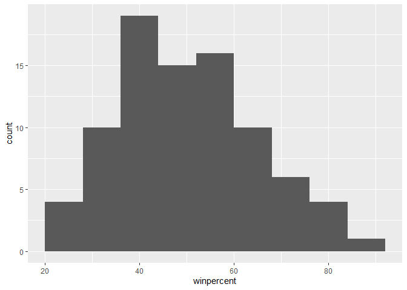
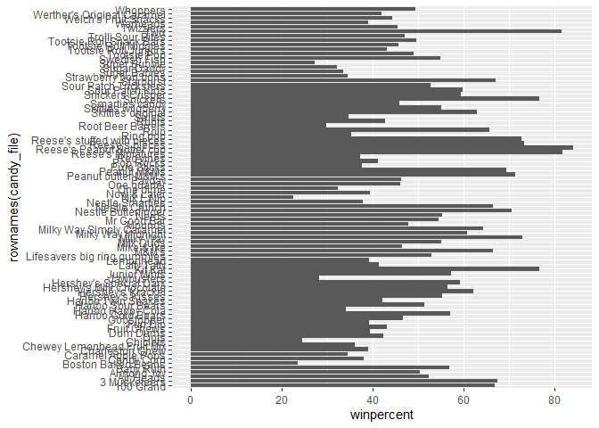
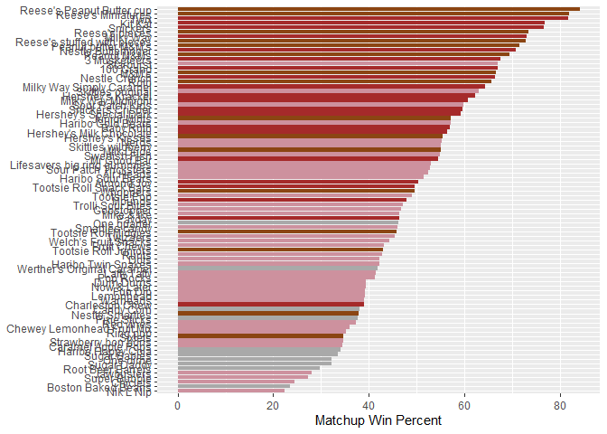
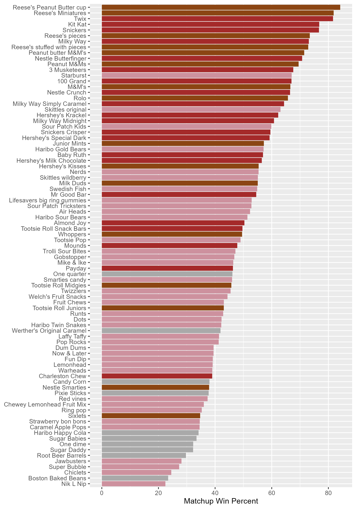
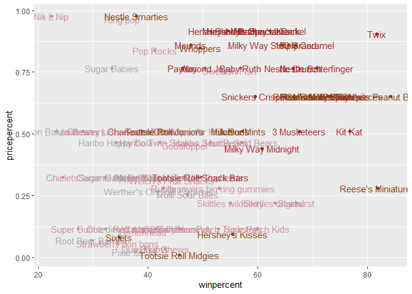
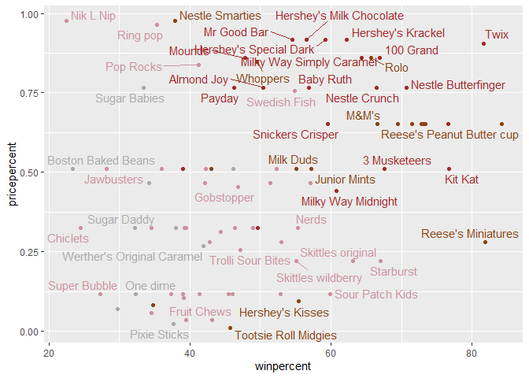
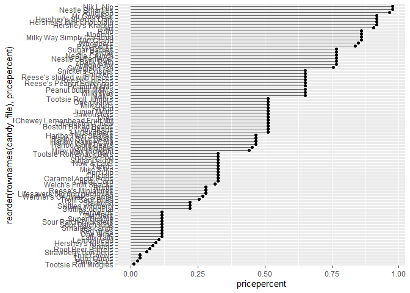
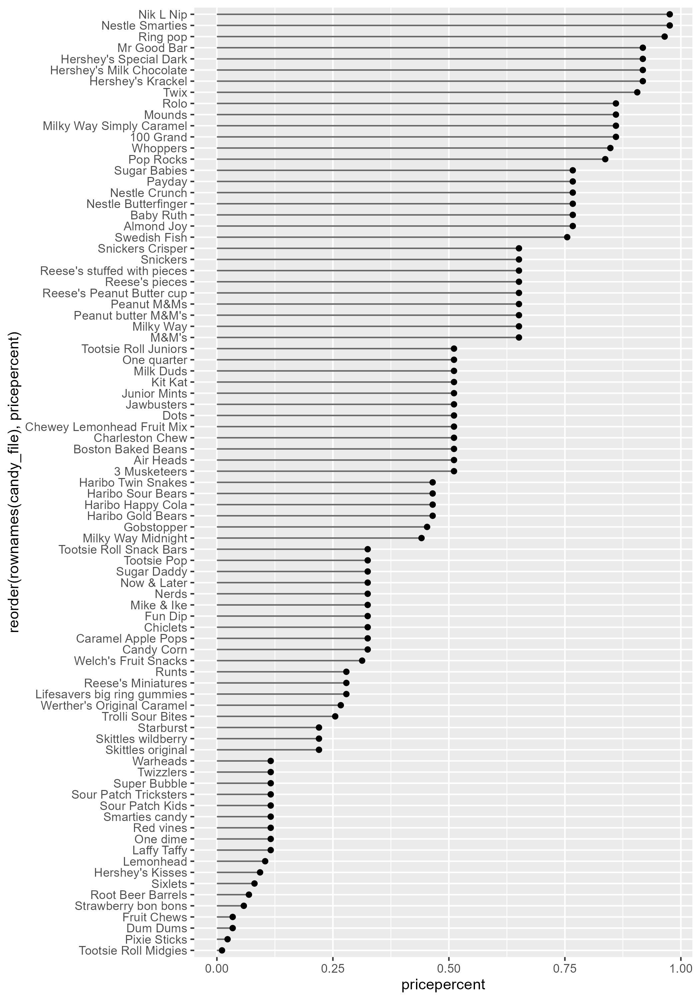
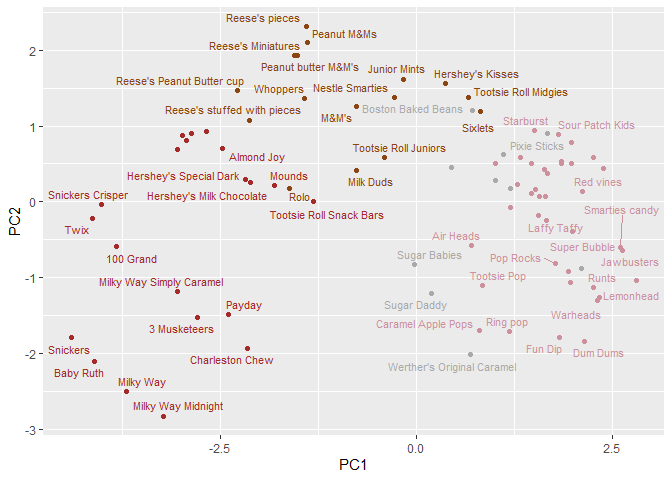
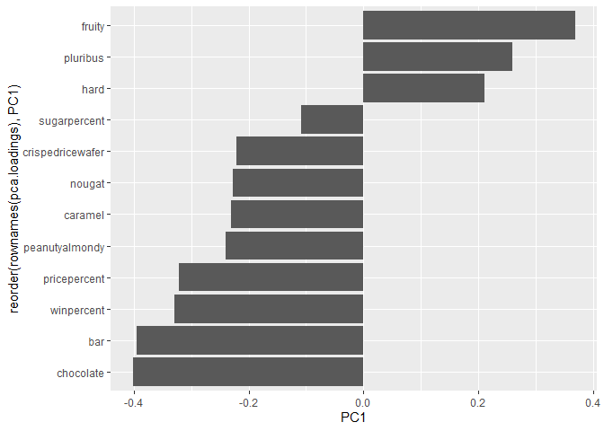

# Class 9
Courtney Cameron PID:A69028599

## Importing candy data

``` r
candy_file <- read.csv("candy-data.txt", row.names=1)

head(candy_file)
```

                 chocolate fruity caramel peanutyalmondy nougat crispedricewafer
    100 Grand            1      0       1              0      0                1
    3 Musketeers         1      0       0              0      1                0
    One dime             0      0       0              0      0                0
    One quarter          0      0       0              0      0                0
    Air Heads            0      1       0              0      0                0
    Almond Joy           1      0       0              1      0                0
                 hard bar pluribus sugarpercent pricepercent winpercent
    100 Grand       0   1        0        0.732        0.860   66.97173
    3 Musketeers    0   1        0        0.604        0.511   67.60294
    One dime        0   0        0        0.011        0.116   32.26109
    One quarter     0   0        0        0.011        0.511   46.11650
    Air Heads       0   0        0        0.906        0.511   52.34146
    Almond Joy      0   1        0        0.465        0.767   50.34755

> Q how many chocolate candy types are in the data set?

37 of the candies are chocolate

``` r
length(grep('1', candy_file$chocolate))
```

    [1] 37

> Q how many fruity candy types are in the data set?

38 of the candies are fruity

``` r
length(grep('1', candy_file$fruity))
```

    [1] 38

> Q how many total candy?

85 different types of candies

``` r
nrow(candy_file)
```

    [1] 85

> Q how many variables/dimesnsions are there

there are 12 different variables/candy types

``` r
ncol(candy_file)
```

    [1] 12

## Data exploration using the package skimr

calling only one function from a package

``` r
#library(skimr)

skimr::skim(candy_file)
```

|                                                  |            |
|:-------------------------------------------------|:-----------|
| Name                                             | candy_file |
| Number of rows                                   | 85         |
| Number of columns                                | 12         |
| \_\_\_\_\_\_\_\_\_\_\_\_\_\_\_\_\_\_\_\_\_\_\_   |            |
| Column type frequency:                           |            |
| numeric                                          | 12         |
| \_\_\_\_\_\_\_\_\_\_\_\_\_\_\_\_\_\_\_\_\_\_\_\_ |            |
| Group variables                                  | None       |

Data summary

**Variable type: numeric**

| skim_variable    | n_missing | complete_rate |  mean |    sd |    p0 |   p25 |   p50 |   p75 |  p100 | hist  |
|:-----------------|----------:|--------------:|------:|------:|------:|------:|------:|------:|------:|:------|
| chocolate        |         0 |             1 |  0.44 |  0.50 |  0.00 |  0.00 |  0.00 |  1.00 |  1.00 | ▇▁▁▁▆ |
| fruity           |         0 |             1 |  0.45 |  0.50 |  0.00 |  0.00 |  0.00 |  1.00 |  1.00 | ▇▁▁▁▆ |
| caramel          |         0 |             1 |  0.16 |  0.37 |  0.00 |  0.00 |  0.00 |  0.00 |  1.00 | ▇▁▁▁▂ |
| peanutyalmondy   |         0 |             1 |  0.16 |  0.37 |  0.00 |  0.00 |  0.00 |  0.00 |  1.00 | ▇▁▁▁▂ |
| nougat           |         0 |             1 |  0.08 |  0.28 |  0.00 |  0.00 |  0.00 |  0.00 |  1.00 | ▇▁▁▁▁ |
| crispedricewafer |         0 |             1 |  0.08 |  0.28 |  0.00 |  0.00 |  0.00 |  0.00 |  1.00 | ▇▁▁▁▁ |
| hard             |         0 |             1 |  0.18 |  0.38 |  0.00 |  0.00 |  0.00 |  0.00 |  1.00 | ▇▁▁▁▂ |
| bar              |         0 |             1 |  0.25 |  0.43 |  0.00 |  0.00 |  0.00 |  0.00 |  1.00 | ▇▁▁▁▂ |
| pluribus         |         0 |             1 |  0.52 |  0.50 |  0.00 |  0.00 |  1.00 |  1.00 |  1.00 | ▇▁▁▁▇ |
| sugarpercent     |         0 |             1 |  0.48 |  0.28 |  0.01 |  0.22 |  0.47 |  0.73 |  0.99 | ▇▇▇▇▆ |
| pricepercent     |         0 |             1 |  0.47 |  0.29 |  0.01 |  0.26 |  0.47 |  0.65 |  0.98 | ▇▇▇▇▆ |
| winpercent       |         0 |             1 | 50.32 | 14.71 | 22.45 | 39.14 | 47.83 | 59.86 | 84.18 | ▃▇▆▅▂ |

## What is your favorite candy

> Q3. What is your favorite candy in the dataset and what is it’s
> winpercent value?

``` r
candy_file['Baby Ruth',]$winpercent
```

    [1] 56.91455

> Q What are the 5 least liked candies

``` r
inds <- order(candy_file$winpercent)

head(candy_file[inds,])
```

                       chocolate fruity caramel peanutyalmondy nougat
    Nik L Nip                  0      1       0              0      0
    Boston Baked Beans         0      0       0              1      0
    Chiclets                   0      1       0              0      0
    Super Bubble               0      1       0              0      0
    Jawbusters                 0      1       0              0      0
    Root Beer Barrels          0      0       0              0      0
                       crispedricewafer hard bar pluribus sugarpercent pricepercent
    Nik L Nip                         0    0   0        1        0.197        0.976
    Boston Baked Beans                0    0   0        1        0.313        0.511
    Chiclets                          0    0   0        1        0.046        0.325
    Super Bubble                      0    0   0        0        0.162        0.116
    Jawbusters                        0    1   0        1        0.093        0.511
    Root Beer Barrels                 0    1   0        1        0.732        0.069
                       winpercent
    Nik L Nip            22.44534
    Boston Baked Beans   23.41782
    Chiclets             24.52499
    Super Bubble         27.30386
    Jawbusters           28.12744
    Root Beer Barrels    29.70369

> Q4. What is the winpercent value for “Kit Kat”?

``` r
candy_file['Kit Kat',]$winpercent
```

    [1] 76.7686

> Q5. What is the winpercent value for “Tootsie Roll Snack Bars”?

``` r
candy_file['Tootsie Roll Snack Bars',]$winpercent
```

    [1] 49.6535

> Q6. Is there any variable/column that looks to be on a different scale
> to the majority of the other columns in the dataset?

The winpercent column of the data set is on a diffenet scale than the
rest of the data set

> Q7. What do you think a zero and one represent for the
> candy\$chocolate column?

The zero means that the candy was not chosen and the 1 represents that
the candy was chosen based on the randomly generated candy matchups

> Q8. Plot a histogram of winpercent values

``` r
library(ggplot2)
```

    Warning: package 'ggplot2' was built under R version 4.2.3

``` r
ggplot(candy_file, aes(winpercent)) +
  geom_histogram(binwidth = 8)
```



> Q9. Is the distribution of winpercent values symmetrical?

the distribution is not symetrical, it is left skewed \>Q10. Is the
center of the distribution above or below 50%?

the center of the distribution is belwo 50% \>Q11. On average is
chocolate candy higher or lower ranked than fruit candy?

-find all chocolate cady (subset) -get the winpercent values -summarice
these values into on metric (mean)

``` r
choc <- subset(candy_file$winpercent, candy_file$chocolate==1)
mean(choc)       
```

    [1] 60.92153

``` r
fruity <- subset(candy_file$winpercent, candy_file$fruity==1)
mean(fruity)
```

    [1] 44.11974

``` r
t.test(choc,fruity)
```


        Welch Two Sample t-test

    data:  choc and fruity
    t = 6.2582, df = 68.882, p-value = 2.871e-08
    alternative hypothesis: true difference in means is not equal to 0
    95 percent confidence interval:
     11.44563 22.15795
    sample estimates:
    mean of x mean of y 
     60.92153  44.11974 

> Q12. Is this difference statistically significant?

the differnece is statistacally significant with a p-value of 2.87e-08

## Overall Candy Rankings

> Q13. What are the five least liked candy types in this set?

``` r
inds <- order(candy_file$winpercent)

head(candy_file[inds,])
```

                       chocolate fruity caramel peanutyalmondy nougat
    Nik L Nip                  0      1       0              0      0
    Boston Baked Beans         0      0       0              1      0
    Chiclets                   0      1       0              0      0
    Super Bubble               0      1       0              0      0
    Jawbusters                 0      1       0              0      0
    Root Beer Barrels          0      0       0              0      0
                       crispedricewafer hard bar pluribus sugarpercent pricepercent
    Nik L Nip                         0    0   0        1        0.197        0.976
    Boston Baked Beans                0    0   0        1        0.313        0.511
    Chiclets                          0    0   0        1        0.046        0.325
    Super Bubble                      0    0   0        0        0.162        0.116
    Jawbusters                        0    1   0        1        0.093        0.511
    Root Beer Barrels                 0    1   0        1        0.732        0.069
                       winpercent
    Nik L Nip            22.44534
    Boston Baked Beans   23.41782
    Chiclets             24.52499
    Super Bubble         27.30386
    Jawbusters           28.12744
    Root Beer Barrels    29.70369

> Q14. What are the top 5 all time favorite candy types out of this set?

``` r
inds <- order(candy_file$winpercent)

tail(candy_file[inds,])
```

                              chocolate fruity caramel peanutyalmondy nougat
    Reese's pieces                    1      0       0              1      0
    Snickers                          1      0       1              1      1
    Kit Kat                           1      0       0              0      0
    Twix                              1      0       1              0      0
    Reese's Miniatures                1      0       0              1      0
    Reese's Peanut Butter cup         1      0       0              1      0
                              crispedricewafer hard bar pluribus sugarpercent
    Reese's pieces                           0    0   0        1        0.406
    Snickers                                 0    0   1        0        0.546
    Kit Kat                                  1    0   1        0        0.313
    Twix                                     1    0   1        0        0.546
    Reese's Miniatures                       0    0   0        0        0.034
    Reese's Peanut Butter cup                0    0   0        0        0.720
                              pricepercent winpercent
    Reese's pieces                   0.651   73.43499
    Snickers                         0.651   76.67378
    Kit Kat                          0.511   76.76860
    Twix                             0.906   81.64291
    Reese's Miniatures               0.279   81.86626
    Reese's Peanut Butter cup        0.651   84.18029

> Q15. Make a first barplot of candy ranking based on winpercent values.

``` r
ggplot(candy_file, aes(winpercent, rownames(candy_file))) +
  geom_col()
```



> Q16. This is quite ugly, use the reorder() function to get the bars
> sorted by winpercent?

creating color vector to color the graph based on the type of candies

``` r
my_cols=rep('darkgrey', nrow(candy_file))
my_cols[as.logical(candy_file$chocolate)] = "chocolate4"
my_cols[as.logical(candy_file$bar)] = "brown"
my_cols[as.logical(candy_file$fruity)] = "pink3"
```

plot was saved because the aspect ratio was bad for readability

``` r
ggplot(candy_file, aes(winpercent, reorder(rownames(candy_file),winpercent))) +
  geom_col(fill=my_cols) +
  labs(x='Matchup Win Percent', y=NULL)
```



``` r
ggsave('barplot.png', height=10, width=7)
```

how to insert any image caption text can go in the square brackets
adding a {} bracket with \#fig, a hyperlink will be added with a link to
the graph



> Q17. What is the worst ranked chocolate candy?

Sixlets

> Q18. What is the best ranked fruity candy?

Nik L Nip

## Taking a look at pricepoint

``` r
ggplot(candy_file, aes(x=winpercent, y=pricepercent, label=rownames(candy_file)))+
  geom_point(col=my_cols) +
  geom_text(col=my_cols)
```



ggrepel package can be used to make point lables look nicer, geom_text
will put in the labels but doesn’t account for overlap

``` r
library(ggrepel)
```

    Warning: package 'ggrepel' was built under R version 4.2.3

``` r
ggplot(candy_file, aes(x=winpercent, y=pricepercent, label=rownames(candy_file)))+
  geom_point(col=my_cols) +
  geom_text_repel(col=my_cols, max.overlaps = 8)
```

    Warning: ggrepel: 37 unlabeled data points (too many overlaps). Consider
    increasing max.overlaps



> Q19. Which candy type is the highest ranked in terms of winpercent for
> the least money - i.e. offers the most bang for your buck?

Reese’s miniatures

> Q20. What are the top 5 most expensive candy types in the dataset and
> of these which is the least popular?

The least popular is the Nik L Nip

``` r
inds2 <- order(candy_file$pricepercent, decreasing=TRUE)

head(candy_file[inds2,c(11,12)], n=5)
```

                             pricepercent winpercent
    Nik L Nip                       0.976   22.44534
    Nestle Smarties                 0.976   37.88719
    Ring pop                        0.965   35.29076
    Hershey's Krackel               0.918   62.28448
    Hershey's Milk Chocolate        0.918   56.49050

> Q21. Make a barplot again with geom_col() this time using pricepercent
> and then improve this step by step, first ordering the x-axis by value
> and finally making a so called “dot chat” or “lollipop” chart by
> swapping geom_col() for geom_point() + geom_segment().

``` r
ggplot(candy_file) +
  aes(pricepercent, reorder(rownames(candy_file), pricepercent)) +
  geom_segment(aes(yend = reorder(rownames(candy_file), pricepercent), 
                   xend = 0), col="gray40") +
    geom_point()
```



``` r
ggsave('barplot2.png', height = 10,width = 7)
```

Because aspect ratio makes seeing the graph dificult, the plot is loaded
in as an image



## Exploring Correlation

``` r
library(corrplot)
```

    Warning: package 'corrplot' was built under R version 4.2.2

    corrplot 0.92 loaded

``` r
cij <- cor(candy_file)
```

``` r
head(cij)
```

                      chocolate     fruity     caramel peanutyalmondy      nougat
    chocolate         1.0000000 -0.7417211  0.24987535     0.37782357  0.25489183
    fruity           -0.7417211  1.0000000 -0.33548538    -0.39928014 -0.26936712
    caramel           0.2498753 -0.3354854  1.00000000     0.05935614  0.32849280
    peanutyalmondy    0.3778236 -0.3992801  0.05935614     1.00000000  0.21311310
    nougat            0.2548918 -0.2693671  0.32849280     0.21311310  1.00000000
    crispedricewafer  0.3412098 -0.2693671  0.21311310    -0.01764631 -0.08974359
                     crispedricewafer       hard        bar   pluribus sugarpercent
    chocolate              0.34120978 -0.3441769  0.5974211 -0.3396752   0.10416906
    fruity                -0.26936712  0.3906775 -0.5150656  0.2997252  -0.03439296
    caramel                0.21311310 -0.1223551  0.3339600 -0.2695850   0.22193335
    peanutyalmondy        -0.01764631 -0.2055566  0.2604196 -0.2061093   0.08788927
    nougat                -0.08974359 -0.1386750  0.5229764 -0.3103388   0.12308135
    crispedricewafer       1.00000000 -0.1386750  0.4237509 -0.2246934   0.06994969
                     pricepercent winpercent
    chocolate           0.5046754  0.6365167
    fruity             -0.4309685 -0.3809381
    caramel             0.2543271  0.2134163
    peanutyalmondy      0.3091532  0.4061922
    nougat              0.1531964  0.1993753
    crispedricewafer    0.3282654  0.3246797

``` r
corrplot(cij)
```


> Q22. Examining this plot what two variables are anti-correlated
> (i.e. have minus values)?

Chocolate and fruity are negatively correlated

> Q23. Similarly, what two variables are most positively correlated?

chocolate highly correlates with bar and winpercent

## PCA

PCA needs to be scaled - scale=TRUE

``` r
pca <- prcomp(candy_file, scale=TRUE)
summary(pca)
```

    Importance of components:
                              PC1    PC2    PC3     PC4    PC5     PC6     PC7
    Standard deviation     2.0788 1.1378 1.1092 1.07533 0.9518 0.81923 0.81530
    Proportion of Variance 0.3601 0.1079 0.1025 0.09636 0.0755 0.05593 0.05539
    Cumulative Proportion  0.3601 0.4680 0.5705 0.66688 0.7424 0.79830 0.85369
                               PC8     PC9    PC10    PC11    PC12
    Standard deviation     0.74530 0.67824 0.62349 0.43974 0.39760
    Proportion of Variance 0.04629 0.03833 0.03239 0.01611 0.01317
    Cumulative Proportion  0.89998 0.93832 0.97071 0.98683 1.00000

``` r
pca_result <- as.data.frame(pca$x)
```

``` r
ggplot(pca_result, aes(x=PC1,y=PC2,label=rownames(pca_result)))+
  geom_point(col=my_cols)+
  geom_text_repel(col=my_cols, max.overlaps = 7, size=3)
```

    Warning: ggrepel: 31 unlabeled data points (too many overlaps). Consider
    increasing max.overlaps



Loadings plot

``` r
pca.loadings <- as.data.frame(pca$rotation)
```

``` r
ggplot(pca.loadings, aes(PC1, reorder(rownames(pca.loadings),PC1)))+
  geom_col()
```



> Q24. What original variables are picked up strongly by PC1 in the
> positive direction? Do these make sense to you?

The positive direction mostly picked up the fruity, pluribus, and hard
candies. This makes sense because these three characteristics are
commonly found together within fruity flavored candies
