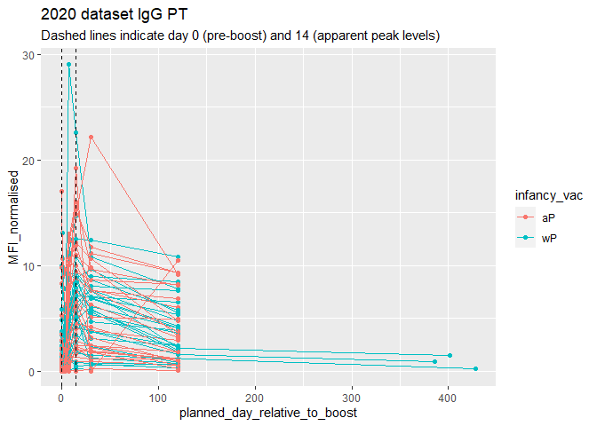

# Class 18
Courtney Cameron PID:A69028599

## Investigating CDC Pertussis Data

> Q1. With the help of the R “addin” package datapasta assign the CDC
> pertussis case number data to a data frame called cdc and use ggplot
> to make a plot of cases numbers over time.

loading in the cdc data frame

``` r
cdc <- data.frame(
                          Year = c(1922L,
                                   1923L,1924L,1925L,1926L,1927L,1928L,
                                   1929L,1930L,1931L,1932L,1933L,1934L,1935L,
                                   1936L,1937L,1938L,1939L,1940L,1941L,
                                   1942L,1943L,1944L,1945L,1946L,1947L,1948L,
                                   1949L,1950L,1951L,1952L,1953L,1954L,
                                   1955L,1956L,1957L,1958L,1959L,1960L,
                                   1961L,1962L,1963L,1964L,1965L,1966L,1967L,
                                   1968L,1969L,1970L,1971L,1972L,1973L,
                                   1974L,1975L,1976L,1977L,1978L,1979L,1980L,
                                   1981L,1982L,1983L,1984L,1985L,1986L,
                                   1987L,1988L,1989L,1990L,1991L,1992L,1993L,
                                   1994L,1995L,1996L,1997L,1998L,1999L,
                                   2000L,2001L,2002L,2003L,2004L,2005L,
                                   2006L,2007L,2008L,2009L,2010L,2011L,2012L,
                                   2013L,2014L,2015L,2016L,2017L,2018L,
                                   2019L,2020L,2021L),
  Cases = c(107473,
                                   164191,165418,152003,202210,181411,
                                   161799,197371,166914,172559,215343,179135,
                                   265269,180518,147237,214652,227319,103188,
                                   183866,222202,191383,191890,109873,
                                   133792,109860,156517,74715,69479,120718,
                                   68687,45030,37129,60886,62786,31732,28295,
                                   32148,40005,14809,11468,17749,17135,
                                   13005,6799,7717,9718,4810,3285,4249,
                                   3036,3287,1759,2402,1738,1010,2177,2063,
                                   1623,1730,1248,1895,2463,2276,3589,
                                   4195,2823,3450,4157,4570,2719,4083,6586,
                                   4617,5137,7796,6564,7405,7298,7867,
                                   7580,9771,11647,25827,25616,15632,10454,
                                   13278,16858,27550,18719,48277,28639,
                                   32971,20762,17972,18975,15609,18617,6124,
                                   2116)
)
```

``` r
library(ggplot2)
```

    Warning: package 'ggplot2' was built under R version 4.2.3

``` r
ggplot(cdc, aes(x=Year, y=Cases))+
  geom_point()+
  geom_line()+
  labs(x='Year', y='Number of Cases', title='Pertussis Cases by Year')
```


> Q2. Using the ggplot geom_vline() function add lines to your previous
> plot for the 1946 introduction of the wP vaccine and the 1996 switch
> to aP vaccine (see example in the hint below). What do you notice?

After the addition of the wP vaccine the number of cases drastically
drops to a consistent low level for over 25 years, but after the siwtch
to the aP vaccine there is and increacrease in cases post 2000.

``` r
ggplot(cdc, aes(x=Year, y=Cases))+
  geom_point()+
  geom_line()+
  labs(x='Year', y='Number of Cases', title='Pertussis Cases by Year')+
  geom_vline(xintercept = 1946, col='blue')+
  geom_vline(xintercept = 1996, col='red')
```


> Q3. Describe what happened after the introduction of the aP vaccine?
> Do you have a possible explanation for the observed trend?

The increase in cases after introduction of the aP vaccine could be
caused by a number of things. The bacteria could have evolved to evade
the vaccine, the vaccine only being anitgens rather than the whole
inactive bacteria could cause the effictivness to drop over time, denial
of vaccines has increased in the 2000’s making it so lower proportion of
people are getting this vaccine, or there could just be better testing
ability than before making the reporting higher.

## Exploring CMI-PB Pertussis Data

``` r
library(jsonlite)
```

    Warning: package 'jsonlite' was built under R version 4.2.3

``` r
subject <- read_json("https://www.cmi-pb.org/api/subject", simplifyVector = TRUE)
```

``` r
head(subject,3)
```

      subject_id infancy_vac biological_sex              ethnicity  race
    1          1          wP         Female Not Hispanic or Latino White
    2          2          wP         Female Not Hispanic or Latino White
    3          3          wP         Female                Unknown White
      year_of_birth date_of_boost      dataset
    1    1986-01-01    2016-09-12 2020_dataset
    2    1968-01-01    2019-01-28 2020_dataset
    3    1983-01-01    2016-10-10 2020_dataset

> Q4. How many aP and wP infancy vaccinated subjects are in the dataset?

58 wP vaccinations and 60 aP vaccinations

``` r
length(grep('wP', subject$infancy_vac))
```

    [1] 58

``` r
length(grep('aP', subject$infancy_vac))
```

    [1] 60

``` r
nrow(subject)
```

    [1] 118

> Q5. How many Male and Female subjects/patients are in the dataset?

39 males and 79 females

``` r
length(grep('Male', subject$biological_sex))
```

    [1] 39

``` r
length(grep('Female', subject$biological_sex))
```

    [1] 79

> Q6. What is the breakdown of race and biological sex (e.g. number of
> Asian females, White males etc…)?

``` r
table(subject$biological_sex, subject$race)
```

            
             American Indian/Alaska Native Asian Black or African American
      Female                             0    21                         2
      Male                               1    11                         0
            
             More Than One Race Native Hawaiian or Other Pacific Islander
      Female                  9                                         1
      Male                    2                                         1
            
             Unknown or Not Reported White
      Female                      11    35
      Male                         4    20

``` r
library(lubridate)
```

    Warning: package 'lubridate' was built under R version 4.2.3


    Attaching package: 'lubridate'

    The following objects are masked from 'package:base':

        date, intersect, setdiff, union

``` r
today()
```

    [1] "2024-03-15"

> Q7. Using this approach determine (i) the average age of wP
> individuals, (ii) the average age of aP individuals; and (iii) are
> they significantly different?

calculate subjects age and adding column to the data frame

``` r
subject$age <- time_length(today() - ymd(subject$year_of_birth),'years')
```

average age of wP subjects

``` r
library(dplyr)
```

    Warning: package 'dplyr' was built under R version 4.2.3


    Attaching package: 'dplyr'

    The following objects are masked from 'package:stats':

        filter, lag

    The following objects are masked from 'package:base':

        intersect, setdiff, setequal, union

``` r
wp <- subject %>% filter(infancy_vac == "wP")
mean(wp$age)
```

    [1] 36.59808

average age of aP subjects

``` r
ap <- subject %>% filter(infancy_vac == "aP")
head(ap)
```

      subject_id infancy_vac biological_sex              ethnicity
    1          9          aP           Male Not Hispanic or Latino
    2         13          aP           Male Not Hispanic or Latino
    3         18          aP         Female     Hispanic or Latino
    4         27          aP         Female Not Hispanic or Latino
    5         29          aP           Male     Hispanic or Latino
    6         32          aP           Male Not Hispanic or Latino
                                           race year_of_birth date_of_boost
    1                                     Asian    1996-01-01    2016-07-25
    2                                     White    1997-01-01    2016-07-25
    3                   Unknown or Not Reported    1997-01-01    2016-08-29
    4                                     Asian    1997-01-01    2016-09-26
    5                                     White    1997-01-01    2016-09-26
    6 Native Hawaiian or Other Pacific Islander    1997-01-01    2016-10-24
           dataset      age
    1 2020_dataset 28.20260
    2 2020_dataset 27.20055
    3 2020_dataset 27.20055
    4 2020_dataset 27.20055
    5 2020_dataset 27.20055
    6 2020_dataset 27.20055

``` r
mean(ap$age)
```

    [1] 26.30135

t test to determine if there is a significant difference between the
ages based on vaccine type: there is a significant difference in the
ages

``` r
t.test(wp$age, ap$age)
```


        Welch Two Sample t-test

    data:  wp$age and ap$age
    t = 12.436, df = 65.411, p-value < 2.2e-16
    alternative hypothesis: true difference in means is not equal to 0
    95 percent confidence interval:
      8.643385 11.950080
    sample estimates:
    mean of x mean of y 
     36.59808  26.30135 

> Q8. Determine the age of all individuals at time of boost?

``` r
int <- ymd(subject$date_of_boost) - ymd(subject$year_of_birth)
subject$boost_age <- time_length(int, "year")

head(subject)
```

      subject_id infancy_vac biological_sex              ethnicity  race
    1          1          wP         Female Not Hispanic or Latino White
    2          2          wP         Female Not Hispanic or Latino White
    3          3          wP         Female                Unknown White
    4          4          wP           Male Not Hispanic or Latino Asian
    5          5          wP           Male Not Hispanic or Latino Asian
    6          6          wP         Female Not Hispanic or Latino White
      year_of_birth date_of_boost      dataset      age boost_age
    1    1986-01-01    2016-09-12 2020_dataset 38.20123  30.69678
    2    1968-01-01    2019-01-28 2020_dataset 56.20260  51.07461
    3    1983-01-01    2016-10-10 2020_dataset 41.20192  33.77413
    4    1988-01-01    2016-08-29 2020_dataset 36.20260  28.65982
    5    1991-01-01    2016-08-29 2020_dataset 33.20192  25.65914
    6    1988-01-01    2016-10-10 2020_dataset 36.20260  28.77481

> Q9. With the help of a faceted boxplot or histogram (see below), do
> you think these two groups are significantly different?

Based on the histogram representation of the data, the ages appear to be
significantly different

``` r
ggplot(subject, aes(age, fill=as.factor(subject$infancy_vac)))+
  geom_histogram(show.legend = FALSE)+
  facet_wrap(vars(infancy_vac), nrow=2)+
  labs(x='Age in Years',y=element_blank())
```

    Warning: Use of `subject$infancy_vac` is discouraged.
    ℹ Use `infancy_vac` instead.

    `stat_bin()` using `bins = 30`. Pick better value with `binwidth`.


# Joining multiple tables

reading in the data

``` r
specimen <- read_json("https://www.cmi-pb.org/api/specimen", simplifyVector = TRUE) 
titer <- read_json("https://www.cmi-pb.org/api/plasma_ab_titer", simplifyVector = TRUE) 
```

> Q9. Complete the code to join specimen and subject tables to make a
> new merged data frame containing all specimen records along with their
> associated subject details:

``` r
meta <- inner_join(specimen, subject)
```

    Joining with `by = join_by(subject_id)`

``` r
dim(meta)
```

    [1] 939  15

> Q10. Now using the same procedure join meta with titer data so we can
> further analyze this data in terms of time of visit aP/wP, male/female
> etc.

``` r
abdata <- inner_join(titer, meta)
```

    Joining with `by = join_by(specimen_id)`

``` r
dim(abdata)
```

    [1] 46906    22

> Q11. How many specimens (i.e. entries in abdata) do we have for each
> isotype?

``` r
table(abdata$isotype)
```


     IgE  IgG IgG1 IgG2 IgG3 IgG4 
    6698 4255 8983 8990 8990 8990 

> Q12. What are the different \$dataset values in abdata and what do you
> notice about the number of rows for the most “recent” dataset?

the number of rows for each data set is smaller every year with 2022
haveing the least number of rows

``` r
table(abdata$dataset)
```


    2020_dataset 2021_dataset 2022_dataset 
           31520         8085         7301 

## Examine IgG Ab titer levels

isolate the data with the IgG isotype

``` r
igg <- abdata %>% filter(isotype == "IgG")
head(igg)
```

      specimen_id isotype is_antigen_specific antigen        MFI MFI_normalised
    1           1     IgG                TRUE      PT   68.56614       3.736992
    2           1     IgG                TRUE     PRN  332.12718       2.602350
    3           1     IgG                TRUE     FHA 1887.12263      34.050956
    4          19     IgG                TRUE      PT   20.11607       1.096366
    5          19     IgG                TRUE     PRN  976.67419       7.652635
    6          19     IgG                TRUE     FHA   60.76626       1.096457
       unit lower_limit_of_detection subject_id actual_day_relative_to_boost
    1 IU/ML                 0.530000          1                           -3
    2 IU/ML                 6.205949          1                           -3
    3 IU/ML                 4.679535          1                           -3
    4 IU/ML                 0.530000          3                           -3
    5 IU/ML                 6.205949          3                           -3
    6 IU/ML                 4.679535          3                           -3
      planned_day_relative_to_boost specimen_type visit infancy_vac biological_sex
    1                             0         Blood     1          wP         Female
    2                             0         Blood     1          wP         Female
    3                             0         Blood     1          wP         Female
    4                             0         Blood     1          wP         Female
    5                             0         Blood     1          wP         Female
    6                             0         Blood     1          wP         Female
                   ethnicity  race year_of_birth date_of_boost      dataset
    1 Not Hispanic or Latino White    1986-01-01    2016-09-12 2020_dataset
    2 Not Hispanic or Latino White    1986-01-01    2016-09-12 2020_dataset
    3 Not Hispanic or Latino White    1986-01-01    2016-09-12 2020_dataset
    4                Unknown White    1983-01-01    2016-10-10 2020_dataset
    5                Unknown White    1983-01-01    2016-10-10 2020_dataset
    6                Unknown White    1983-01-01    2016-10-10 2020_dataset
           age boost_age
    1 38.20123  30.69678
    2 38.20123  30.69678
    3 38.20123  30.69678
    4 41.20192  33.77413
    5 41.20192  33.77413
    6 41.20192  33.77413

> Q13. Complete the following code to make a summary boxplot of Ab titer
> levels (MFI) for all antigens:

``` r
ggplot(igg) +
  aes(MFI_normalised, antigen) +
  geom_boxplot() + 
    xlim(0,75) +
  facet_wrap(vars(visit), nrow=2)
```

    Warning: Removed 5 rows containing non-finite values (`stat_boxplot()`).


> Q14. What antigens show differences in the level of IgG antibody
> titers recognizing them over time? Why these and not others?

graph to see difference between wP and aP

``` r
ggplot(igg) +
  aes(MFI_normalised, antigen, col=infancy_vac ) +
  geom_boxplot(show.legend = FALSE) + 
  facet_wrap(vars(visit), nrow=2) +
  xlim(0,75) +
  theme_bw()
```

    Warning: Removed 5 rows containing non-finite values (`stat_boxplot()`).


> Q15. Filter to pull out only two specific antigens for analysis and
> create a boxplot for each. You can chose any you like. Below I picked
> a “control” antigen (“OVA”, that is not in our vaccines) and a clear
> antigen of interest (“PT”, Pertussis Toxin, one of the key virulence
> factors produced by the bacterium B. pertussis). and the same for
> antigen==“FIM2/3”

OVA antigen

``` r
filter(igg, antigen=="OVA") %>%
  ggplot() +
  aes(MFI_normalised, col=infancy_vac) +
  geom_boxplot(show.legend = FALSE) +
  facet_wrap(vars(visit)) +
  theme_bw()
```


PT antigen

``` r
filter(igg, antigen=='PT') %>%
  ggplot() +
  aes(MFI_normalised, col=infancy_vac) +
  geom_boxplot(show.legend = FALSE) +
  facet_wrap(vars(visit)) +
  theme_bw()
```


FIM2/3 antigen

``` r
filter(igg, antigen=='FIM2/3') %>%
  ggplot() +
  aes(MFI_normalised, col=infancy_vac) +
  geom_boxplot(show.legend = FALSE) +
  facet_wrap(vars(visit)) +
  theme_bw()
```


> Q16. What do you notice about these two antigens time courses and the
> PT data in particular?

When compaing the PT response to OVA response, the PT antigen levels
appear to increase over time with a peak at week 6 and then the levels
fall, while OVA just slowly rises over time course. The FIM2/3 increases
over the time course, again peaking around week 6 and it seems to also
start to decrease but there isn’t the data to be sure of a clear
decrease. both PT and FIM2/3 have overall higher antigen levels than
OVA.

> Q17. Do you see any clear difference in aP vs. wP responses?

The PT and FIM2/3 responses are fairly consistent between the aP and wP
responses but there is more variation in the OVA response with wP being
a slightly slower but higher response.

``` r
abdata.21 <- abdata %>% filter(dataset == "2021_dataset")

abdata.21 %>% 
  filter(isotype == "IgG",  antigen == "PT") %>%
  ggplot() +
    aes(x=planned_day_relative_to_boost,
        y=MFI_normalised,
        col=infancy_vac,
        group=subject_id) +
    geom_point() +
    geom_line() +
    geom_vline(xintercept=0, linetype="dashed") +
    geom_vline(xintercept=14, linetype="dashed") +
  labs(title="2021 dataset IgG PT",
       subtitle = "Dashed lines indicate day 0 (pre-boost) and 14 (apparent peak levels)")
```


``` r
abdata.20 <- abdata %>% filter(dataset == "2020_dataset")

abdata.20 %>% 
  filter(isotype == "IgG",  antigen == "PT") %>%
  ggplot() +
    aes(x=planned_day_relative_to_boost,
        y=MFI_normalised,
        col=infancy_vac,
        group=subject_id) +
    geom_point() +
    geom_line() +
    geom_vline(xintercept=0, linetype="dashed") +
    geom_vline(xintercept=14, linetype="dashed") +
  labs(title="2020 dataset IgG PT",
       subtitle = "Dashed lines indicate day 0 (pre-boost) and 14 (apparent peak levels)")
```



adding an x axis limit to better visualize the data

``` r
abdata.20 %>% 
  filter(isotype == "IgG",  antigen == "PT") %>%
  ggplot() +
    aes(x=planned_day_relative_to_boost,
        y=MFI_normalised,
        col=infancy_vac,
        group=subject_id) +
    geom_point() +
    geom_line() +
    geom_vline(xintercept=0, linetype="dashed") +
    geom_vline(xintercept=14, linetype="dashed") +
  labs(title="2020 dataset IgG PT",
       subtitle = "Dashed lines indicate day 0 (pre-boost) and 14 (apparent peak levels)")+
  xlim(0,125)
```

    Warning: Removed 3 rows containing missing values (`geom_point()`).

    Warning: Removed 3 rows containing missing values (`geom_line()`).


> Q18. Does this trend look similar for the 2020 dataset?

The 14 day peak is consistent but in the 2020 data there is an overall
higher MFI and there is less of a distinct difference between the aP and
wP MFIs

## Obtaining CMI-PB RNASeq data

``` r
url <- "https://www.cmi-pb.org/api/v2/rnaseq?versioned_ensembl_gene_id=eq.ENSG00000211896.7"

rna <- read_json(url, simplifyVector = TRUE) 
```

``` r
ssrna <- inner_join(rna, meta)
```

    Joining with `by = join_by(specimen_id)`

> Q19. Make a plot of the time course of gene expression for IGHG1 gene
> (i.e. a plot of visit vs. tpm).

``` r
ggplot(ssrna) +
  aes(visit, tpm, group=subject_id) +
  geom_point() +
  geom_line(alpha=0.2)
```


> Q20.: What do you notice about the expression of this gene (i.e. when
> is it at it’s maximum level)?

Peak of expression appears to happen around visit 4 or 5

> Q21. Does this pattern in time match the trend of antibody titer data?
> If not, why not?

The increase in gene expression appears to be at it’s highest at the
visit before the peak seen from the antibody titer data or at the same
visit of the highest measured antibody for PT and FIM2/3. Based on the
data it appears that the expression of this gene coincides with with
increase in these antibodies.

graphing gene expression based on vaccine type

``` r
ggplot(ssrna) +
  aes(tpm, col=infancy_vac) +
  geom_boxplot() +
  facet_wrap(vars(visit))
```


looking closer at expression recorded on only visit 4

``` r
ssrna %>%  
  filter(visit==4) %>% 
  ggplot() +
    aes(tpm, col=infancy_vac) + geom_density() + 
    geom_rug() 
```


