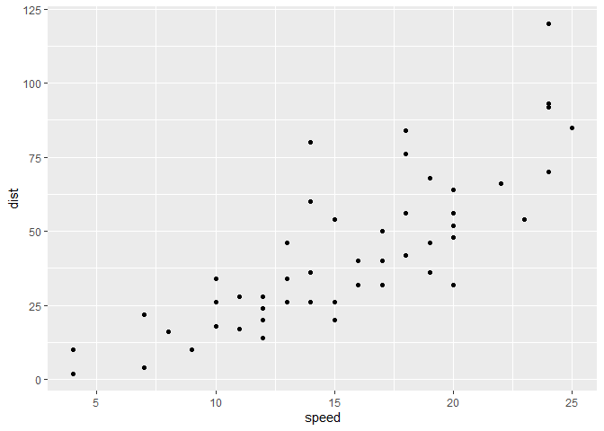
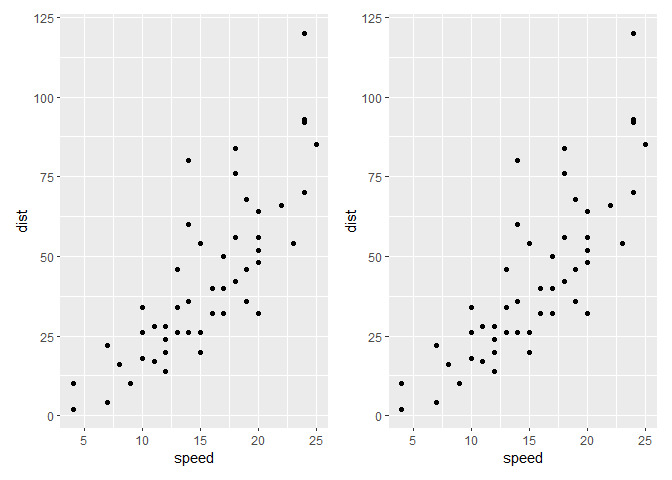
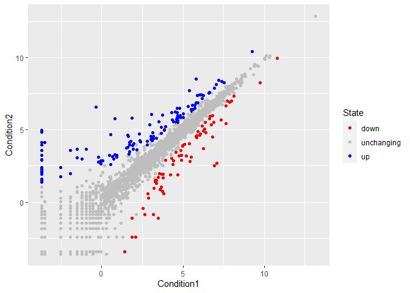
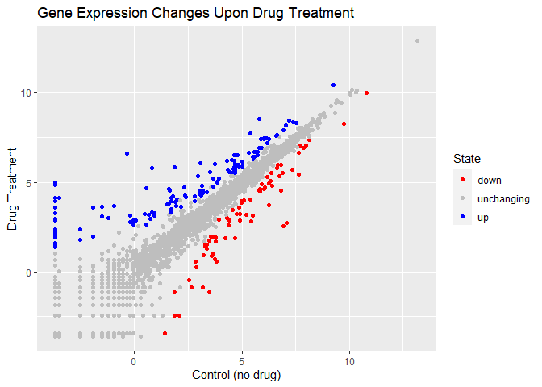
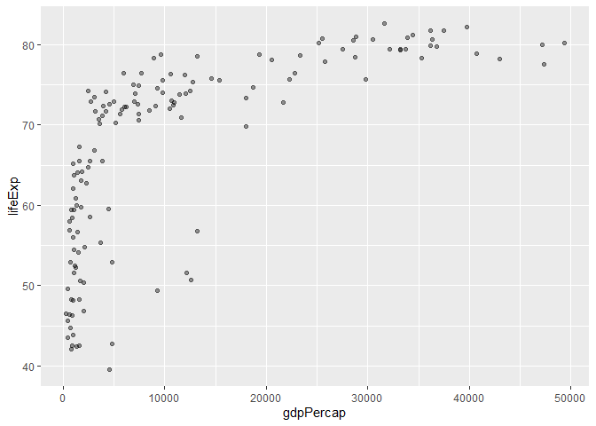
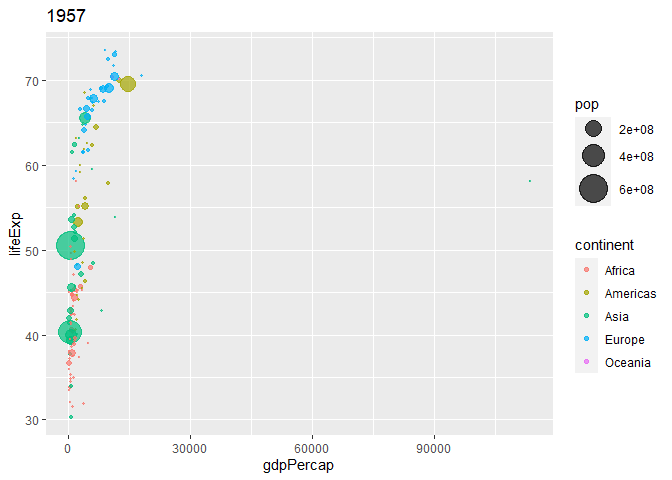
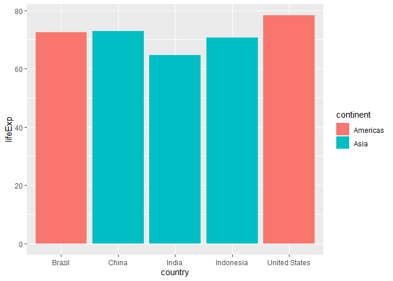
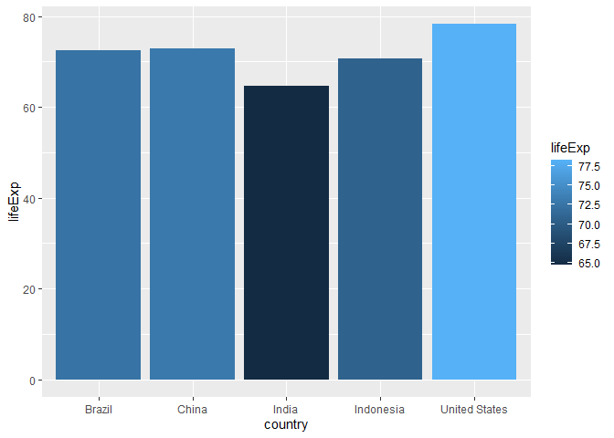

# Class5
Courtney Cameron PID: A69028599

# Graphic systems in R

Base R graph

``` r
plot(cars)
```


ggplot2 graph

``` r
library(ggplot2)
```

    Warning: package 'ggplot2' was built under R version 4.2.3

each graph needs 3 layers:

- **data**

- **aes**

- **geoms**

``` r
ggplot(cars, aes(x=speed, y=dist)) +
  geom_point()
```



``` r
ggplot(cars, aes(x=speed, y=dist)) +
  geom_point() +
  geom_smooth() +
  labs(title = 'Stopping Distance of Old Cars') +
  theme_bw()
```

    `geom_smooth()` using method = 'loess' and formula = 'y ~ x'


``` r
p <- ggplot(cars, aes(x=speed, y=dist)) +
  geom_point()

p + geom_smooth(method = 'lm', se = FALSE)
```

    `geom_smooth()` using formula = 'y ~ x'


``` r
library(patchwork)
```

    Warning: package 'patchwork' was built under R version 4.2.3

``` r
p | p
```



\#Adding more plot aestethics through aes()

``` r
url <- "https://bioboot.github.io/bimm143_S20/class-material/up_down_expression.txt"
genes <- read.delim(url)
head(genes)
```

            Gene Condition1 Condition2      State
    1      A4GNT -3.6808610 -3.4401355 unchanging
    2       AAAS  4.5479580  4.3864126 unchanging
    3      AASDH  3.7190695  3.4787276 unchanging
    4       AATF  5.0784720  5.0151916 unchanging
    5       AATK  0.4711421  0.5598642 unchanging
    6 AB015752.4 -3.6808610 -3.5921390 unchanging

``` r
nrow(genes)
```

    [1] 5196

``` r
colnames(genes)
```

    [1] "Gene"       "Condition1" "Condition2" "State"     

``` r
ncol(genes)
```

    [1] 4

``` r
table(genes$State)
```


          down unchanging         up 
            72       4997        127 

``` r
round(table(genes$State)/nrow(genes)*100,2)
```


          down unchanging         up 
          1.39      96.17       2.44 

``` r
p2<- ggplot(genes, aes(x=Condition1, y=Condition2, col = State)) +
  geom_point()

p2
```


``` r
p2 + scale_color_manual(values = c('red','grey','blue'))
```



``` r
p2 + scale_color_manual(values=c('red','grey','blue')) +
  labs(title= 'Gene Expression Changes Upon Drug Treatment', x= 'Control (no drug)', y='Drug Treatment')
```



\#Using plotly to generate annotated graphs

``` r
library(plotly)
```

    Warning: package 'plotly' was built under R version 4.2.3

``` r
p3 <- ggplot(genes, aes(x=Condition1, y=Condition2, col = State, name = Gene)) + geom_point()+
  scale_color_manual(values=c('red','grey','blue')) +
  labs(title= 'Gene Expression Changes Upon Drug Treatment', x= 'Control (no drug)', y='Drug Treatment')


#ggplotly(p3)
```

\#Going Further

``` r
# File location online
url <- "https://raw.githubusercontent.com/jennybc/gapminder/master/inst/extdata/gapminder.tsv"

gapminder <- read.delim(url)
head(gapminder)
```

          country continent year lifeExp      pop gdpPercap
    1 Afghanistan      Asia 1952  28.801  8425333  779.4453
    2 Afghanistan      Asia 1957  30.332  9240934  820.8530
    3 Afghanistan      Asia 1962  31.997 10267083  853.1007
    4 Afghanistan      Asia 1967  34.020 11537966  836.1971
    5 Afghanistan      Asia 1972  36.088 13079460  739.9811
    6 Afghanistan      Asia 1977  38.438 14880372  786.1134

``` r
library(dplyr)
```

    Warning: package 'dplyr' was built under R version 4.2.3


    Attaching package: 'dplyr'

    The following objects are masked from 'package:stats':

        filter, lag

    The following objects are masked from 'package:base':

        intersect, setdiff, setequal, union

``` r
gapmainder_2007 <- gapminder %>% filter(year==2007)
```

``` r
ggplot(gapmainder_2007, aes(x=gdpPercap, y=lifeExp)) +
  geom_point(alpha=0.4)
```



``` r
ggplot(gapmainder_2007, aes(x=gdpPercap, y=lifeExp, col=continent, size=pop)) +
  geom_point(alpha = 0.5)
```


``` r
ggplot(gapmainder_2007, aes(x=gdpPercap, y=lifeExp, col=pop)) +
  geom_point(alpha = 0.8)
```


``` r
ggplot(gapmainder_2007, aes(x=gdpPercap, y=lifeExp,size=pop)) +
  geom_point(alpha = 0.5)
```


``` r
ggplot(gapmainder_2007, aes(x=gdpPercap, y=lifeExp,size=pop)) +
  geom_point(alpha = 0.5) +
  scale_size_area(max_size = 10)
```


\#gapmider 1957 data

``` r
gapminder_1957 <- gapminder %>% filter(year==1957)

 ggplot(gapminder_1957, aes(x=gdpPercap, y=lifeExp, col=continent,size=pop)) +
  geom_point(alpha=0.7) +
  scale_size_area(max_size = 10) +
   labs(title='1957')
```



\#Using Facet_wrap to combine graphs of the same data set

``` r
 gapminder_1957_2007 <- gapminder %>% filter(year==1957|year==2007)
 
  ggplot(gapminder_1957_2007, aes(x=gdpPercap, y=lifeExp, col=continent,size=pop)) +
  geom_point(alpha=0.7) +
  scale_size_area(max_size = 10) +
    facet_wrap(~year)
```


\#Bar charts

Sort to have the top 5 based on population

``` r
gapminder_top5 <- gapminder %>% 
  filter(year==2007) %>% 
  arrange(desc(pop)) %>% 
  top_n(5, pop)

gapminder_top5
```

            country continent year lifeExp        pop gdpPercap
    1         China      Asia 2007  72.961 1318683096  4959.115
    2         India      Asia 2007  64.698 1110396331  2452.210
    3 United States  Americas 2007  78.242  301139947 42951.653
    4     Indonesia      Asia 2007  70.650  223547000  3540.652
    5        Brazil  Americas 2007  72.390  190010647  9065.801

``` r
ggplot(gapminder_top5, aes(x=country, y=pop)) +
  geom_col()
```


``` r
ggplot(gapminder_top5, aes(x=country, y=lifeExp)) +
  geom_col()
```


``` r
ggplot(gapminder_top5, aes(x=country, y=lifeExp, fill=continent)) +
  geom_col()
```



``` r
ggplot(gapminder_top5, aes(x=country, y=lifeExp, fill=lifeExp)) +
  geom_col()
```



``` r
ggplot(gapminder_top5, aes(x=country, y=pop, fill = gdpPercap)) +
  geom_col()
```


``` r
ggplot(gapminder_top5, aes(x=reorder(country, -pop), y=pop, fill = gdpPercap)) +
  geom_col()
```


``` r
ggplot(gapminder_top5, aes(x=reorder(country, -pop), y=pop, fill=country))+
  geom_col(col='grey30') +
  guides(fill='none')
```


\#Flipping bar charts

``` r
head(USArrests)
```

               Murder Assault UrbanPop Rape
    Alabama      13.2     236       58 21.2
    Alaska       10.0     263       48 44.5
    Arizona       8.1     294       80 31.0
    Arkansas      8.8     190       50 19.5
    California    9.0     276       91 40.6
    Colorado      7.9     204       78 38.7

``` r
USArrests$State <- rownames((USArrests))

ggplot(USArrests, aes(x=reorder(State,Murder), y=Murder)) +
  geom_col() +
  coord_flip()
```


``` r
ggplot(USArrests, aes(x=reorder(State,Murder), y=Murder)) +
  geom_point() +
  coord_flip()+
  geom_segment(aes(x=State, xend=State, y=0, yend=Murder,),col='blue')
```


\#Extensions: Animations

graph is commented out for pdf format

``` r
library(gapminder)
```

    Warning: package 'gapminder' was built under R version 4.2.3


    Attaching package: 'gapminder'

    The following object is masked _by_ '.GlobalEnv':

        gapminder

``` r
library(gganimate)
```

    Warning: package 'gganimate' was built under R version 4.2.3

``` r
#ggplot(gapminder, aes(gdpPercap, lifeExp, size = pop, colour = continent)) +
 # geom_point(alpha = 0.7, show.legend = FALSE) +
# scale_colour_manual(values = country_colors) +
  #scale_size(range = c(2, 12)) +
  #scale_x_log10() +
  #facet_wrap(~continent) +
  #labs(title = 'Year: {frame_time}', x = 'GDP per capita', y = 'life expectancy') +
  #transition_time(year) +
  #shadow_wake(wake_length = 0.1, alpha = FALSE)
```

\#combining plots

``` r
p1 <- ggplot(mtcars) + geom_point(aes(mpg, disp))
p2 <- ggplot(mtcars) + geom_boxplot(aes(gear, disp, group = gear))
p3 <- ggplot(mtcars) + geom_smooth(aes(disp, qsec))
p4 <- ggplot(mtcars) + geom_bar(aes(carb))

(p1|p2|p3)/p4
```

    `geom_smooth()` using method = 'loess' and formula = 'y ~ x'


